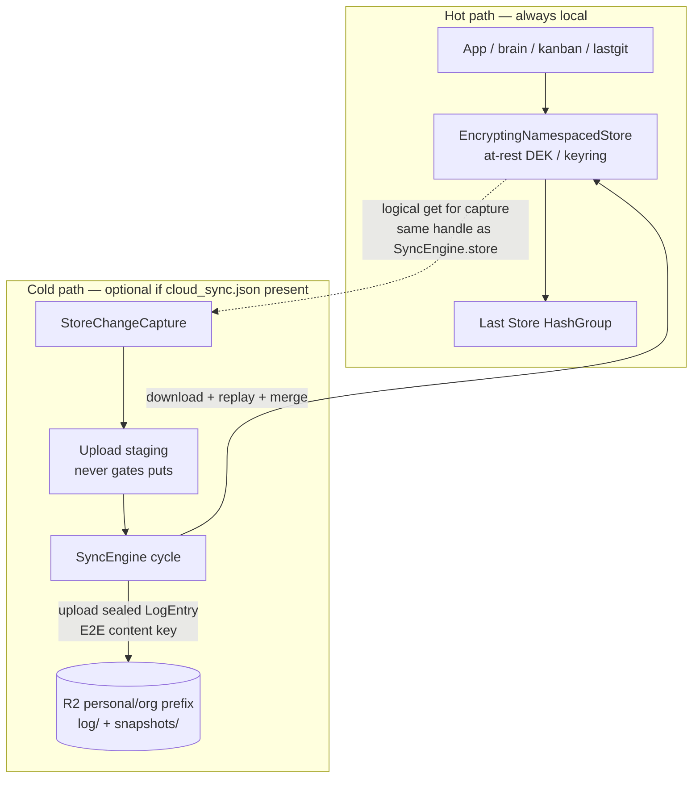
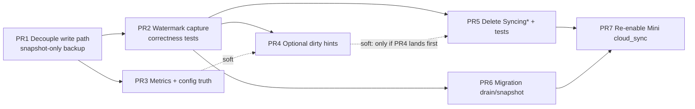

# Design: Store-level log-based backup/replication (rip write-path CDC outbox)

| Field | Value |
|-------|--------|
| Status | Proposed (rev 3 — C4 local-win absorb + C11 pending export) |
| Date | 2026-07-15 |
| Product owner | Tom |
| Repo | `EdgeVector/fold` (Forge-hot) — paths under `fold_db/…`, `lastdb_node/…` |
| Preference | `preference-cloud-sync-never-blocks-local-rw` |
| Supersedes | Write-path `SyncingKvStore` → durable outbox → upload coupling. The **drop-oldest** policy landed ~2026-07-16 as a temporary bandage after the 2026-07-15 Phase-1 freezes; this design replaces both reject and drop-oldest-as-write-path-coupling. |

---

## Overview

LastDB Mini’s live read/write path must treat the **local Last Store / HashGroup home as source of truth**. Cloud personal/org sync is an **optional, best-effort backup and multi-device replication plane**. It must never gate, reject, or stall local mutations.

Today every synced `put`/`delete`/`batch_*` goes through `SyncingKvStore`, which **records into a durable outbox before (or as a precondition of) local mutation**. When the outbox/caps fill (or historically reject), the primary Mini brain freezes. Drop-oldest (~2026-07-16) stops hard reject but still **couples cloud bookkeeping into the hot write path** (extra flushes, capacity logic, rollback of outbox seqs, wake notifications).

This design:

1. **Rips write-path CDC out of the KvStore stack** — local R/W depends only on local storage + local crypto.
2. **Keeps the existing sealed log wire format, upload/download cycle, snapshot bootstrap, and merge/replay** — rewire production of log entries off the hot path.
3. **Produces store-derived, merge-capable device logs** so offline multi-writer reconcile works (not last-whole-file-wins only), with **testable capture correctness** (watermark = upload-acked export-baseline; advance only after upload; peer-key deletes; outcome-gated replay absorb; pending-export de-dupe).
4. **Phases** so each PR is independently mergeable; PR1 restores local-first; multi-device incremental requires PR2+ gates before cloud re-enable.



---

## Goals / Non-goals

### Goals

1. **Local-first invariant (won't-undo):** `put` / `delete` / `batch_*` success depends only on local storage + local at-rest crypto. No outbox capacity check, no network, no sync engine failure mapped to `StorageError` on the write path.
2. **Optional cloud:** absence, pause, quota exhaustion, full staging queue, offline = **degraded backup only** (`SyncState::Dirty` / `Offline` + status metrics), never frozen Mini.
3. **Log-based multi-device merge:** device A and B write offline; on reconnect both device logs apply through existing replay (`replay_per_key_record` LWW on `written_at`, HashRange `MergeMolecule`, conflict records). Prefer wire-compat with existing `LogEntry` / sealed objects in R2. **v1 optimizes local R/W latency, not cloud RTO** (see Observability).
4. **Store-level capture:** change capture is **derived from store state or store-adjacent cold path**, not interleaved as a precondition of every API write.
5. **Reuse, don’t reinvent:** keep `SyncEngine` transfer, auth/presign, bootstrap, compact, backup_snapshot, download cursors, poison gates, and merge.
6. **Incremental PR plan** with independent mergeability; first ship removes write-path coupling; multi-device incremental is gated before re-enable.

### Non-goals

- Dual LastGit, dual-path LastGit workarounds, or inventing a second sync plane for git objects.
- Re-key / master-key migration schemes.
- Desktop Tauri / DMG / `fold_db_node` (deprecated — Situation `fold-db-node-dmg-temporary-deprecation`).
- Changing Exemem billing, metering product rules, or R2 layout for files/`cas/`.
- Conflating **deliver/messaging outbox** (`lastdb_node/src/deliver.rs` slice staging) with **cloud sync staging** — deliver stays as-is.
- Perfect zero-RPO cloud mirror under capture overflow (snapshot re-converge is acceptable).
- Peer-to-peer mesh or real-time CRDT beyond existing merge semantics.
- **Log format version bump** — keep `LogEntry` / `LogOp` / seal layout wire-compatible.
- Linearizable CDC or single-tick completeness under concurrent writers.

---

## Current State

### Write-path coupling (RIP TARGET)

| Piece | Path | Behavior |
|-------|------|----------|
| Store stack factory | `fold_db/crates/core/src/fold_db_core/factory/local/store_stack.rs` | When `LocalSyncSetup` present: builds at-rest `EncryptingNamespacedStore`, gives it to `SyncEngine` as `engine_store`, then wraps it with `SyncingNamespacedStore` as the **serving** store |
| Seam policy | `fold_db/crates/core/src/fold_db_core/factory/local.rs` | **“Keep sync above the at-rest seam”** — at-rest may use non-portable keyring DEK; cloud payloads must be portable E2E |
| Namespace decorator | `fold_db/crates/core/src/storage/syncing_namespaced_store.rs` | Opens each NS as `SyncingKvStore` except `LOCAL_ONLY_NAMESPACES` |
| Kv decorator | `fold_db/crates/core/src/storage/syncing_store.rs` | On `put`/`batch_*`: `record_*` **before** `inner.put` (inner = encrypting); on `delete`: `require_sync_capacity` then `record_delete` then mutate. **File comment diagram is wrong** (claims Syncing below Encrypting); factory wiring is authoritative |
| Outbox | `fold_db/crates/core/src/sync/engine/outbox.rs` | Namespace `sync_outbox`, keys `entry:{seq:020}`; `record_op` → `persist_outbox_entry` (flush) → admit to in-memory `pending` queue |
| Capacity | `fold_db/crates/core/src/sync/engine/wiring.rs`, `fold_db/crates/core/src/sync/capture/worker.rs` | `require_pending_capacity` never gates the write path (always `Ok`). `maybe_force_snapshot_for_outbox_overflow` (called from the sync cycle, off the write path) is the only place staging depth ever drops: past `max_outbox_entries` depth **or** `outbox_overflow_max_age_secs` age, force a `backup_snapshot`, and only clear staging once that snapshot succeeds (never drop-oldest, never reject). Historical policy **rejected** writes (Phase-1 freezes); drop-oldest (~2026-07-16) was the interim bandage; this is the standing valve (2026-07-18) |
| Config / status truth | `fold_db/crates/core/src/sync/engine/types/config.rs`, `fold_db/crates/core/src/sync/engine/types/status.rs`, `lastdb_node/src/ops/self_metrics.rs` | `max_outbox_entries` / `durable_outbox_max` are upload-staging health thresholds only. They may degrade sync and trigger a force-snapshot-then-clear, but must never reject or drop-oldest local DB mutations. |

### Stack today (cloud on) — factory truth

From `build_syncing_store_stack`:

```text
App / Typed layers
  → SyncingNamespacedStore / SyncingKvStore   ← CDC records LOGICAL values
       → EncryptingNamespacedStore            ← at-rest (may use keyring DEK)
            → Last Store / HashGroup collections
```

**Payload semantics (normative for capture):**

- `SyncingKvStore::put` receives the value **before** at-rest encryption and `record_put`s those **portable logical bytes**.
- `SyncEngine.store` is the **encrypting** namespaced store: `get` returns logical bytes (decrypt-on-read); snapshot/replay put logical bytes.
- Cloud seal uses account **E2E content key** (`LocalCryptoProvider::from_key(e2e_keys.encryption_key())`), never the at-rest keyring DEK.
- Legacy dual-read: some old log values may still be `ENC:…` at-rest envelopes (`unwrap_at_rest_value` in `replay/decode.rs`). New capture must emit **logical portable** values (no keyring-only ciphertext).

**Comment drift:** `syncing_store.rs` module docs and some replay comments claim “Syncing below Encrypting.” **Ignore those comments; factory + `local.rs` seam policy are source of truth.** Fix comments when ripping Syncing*.

**Defaults that hurt under backlog:** `max_pending: 1`, `max_outbox_entries: 100_000`, `max_upload_entries_per_cycle: 1`, `max_upload_bytes_per_cycle: 8 MiB` (`SyncConfig::default`). Upload is intentionally slow for memory safety; that made write-coupled outbox depth the failure mode.

### What already works (REUSE)

| Capability | Location | Keep? |
|------------|----------|-------|
| `LogEntry` / `LogOp` / seal+sha256 | `sync/log.rs` | Yes — wire-compat; **no format version bump** |
| Upload/download cycle | `sync/engine/cycle.rs` (`do_sync`) | Yes |
| Transfer / S3 / personal index | `sync/engine/transfer/` | Yes |
| Snapshot create/seal/bootstrap | `sync/snapshot/`, `engine/backup.rs`, `engine/bootstrap.rs`, `engine/compact.rs` | Yes |
| Replay + molecule merge | `sync/engine/replay/` (`apply.rs`, `records.rs`, `merge.rs`, `order.rs`) | Yes — multi-device truth |
| Download cursors | `sync_cursors` NS on **raw** `cursor_store` (`base_store`) | Yes — skip in capture |
| Outbox NS | `sync_outbox` | Retarget as **upload staging only** |
| Quarantine NS | `sync_replay_quarantine` | Skip in capture |
| Node intent file | `lastdb_node/src/cloud.rs`, `host.rs` — `cloud_sync.json` | Yes |
| Metrics | `lastdb_node/src/ops/self_metrics.rs` | Rewire names/semantics |
| Auth / presign / Exemem | `sync/auth/`, `sync/s3.rs` | Yes |

### Merge semantics (preserve — replay is sole merge authority)

| Key class | Merge rule (in `replay/*`) |
|-----------|----------------------------|
| `mk:{M}:…` per-key molecule records | LWW on payload `AtomEntry.written_at`; conflict rows when different `atom_uuid` |
| `mh:{M}` headers | field-wise max (`version`, `updated_at`) |
| `mord:` / `moc:` / legacy `mo:` order logs | keep-if-absent / larger count / longest vector — **not** `written_at` LWW |
| Legacy `ref:` blobs | migrate-on-receive → per-key |
| Opaque keys (incl. `native_index` emb) | unconditional put of incoming |
| Deletes | replay delete path (existing) |

**Do not use `LogEntry.timestamp_ms` for molecule LWW.** Code already passes `_timestamp_ms` / `_device_id` unused into `replay_put`. Device `device_id` remains for audit and object identity. Capture must **not** invent new causality from wall-clock batch order.

### Namespace policy (full inventory)

Source: `db_operations/core/mod.rs` open list + sync bookkeeping + encrypting internals.

| Namespace | Class | Capture / snapshot / log? | Notes |
|-----------|-------|---------------------------|-------|
| `main` | **sync** | Yes | Atoms, molecules, history, conflicts |
| `metadata` | **sync** | Yes | |
| `schemas` | **sync** | Yes | |
| `schema_states` | **sync** | Yes | Opened by DbOperations; **not** local-only today |
| `schema_superseded_by` | **sync** | Yes | (schema_store tests also use `superseded_by` alias — confirm production name is `schema_superseded_by`) |
| `public_keys` | **sync** | Yes | Multi-device key material |
| `native_index` | **sync** (product 2026-07-15) | Yes | Large; capacity-sensitive (see § native_index scale). **Code drift:** still in `LOCAL_ONLY_NAMESPACES` in this checkout — fix to match product |
| `lineage_forward` | **local-only** | No | Derived |
| `lineage_reverse` | **local-only** | No | Derived |
| `idempotency` | **local-only** | No | Per-node request cache |
| `process_results` | **local-only** | No | Legacy desktop |
| `sync_outbox` | **internal** | No | Upload staging |
| `sync_capture` | **internal** (new) | No | Watermark + capture meta |
| `sync_cursors` | **internal** | No | On raw `base_store` / cursor_store |
| `sync_replay_quarantine` | **internal** | No | |
| `__sled__default` | **internal** | No | Already skipped by snapshot |
| `__at_rest_strict_markers` | **internal** | No | `STRICT_MARKER_NAMESPACE` in `encrypting_namespaced_store/mod.rs` — never user data |

**Policy module (single source of truth after move):** `sync/policy.rs` (or equivalent) with:

- `is_local_only(name)`
- `is_sync_internal(name)` — `sync_outbox`, `sync_capture`, `sync_cursors`, `sync_replay_quarantine`, `__sled__default`, `__at_rest_strict_markers`
- `capture_should_skip_namespace(name) := is_local_only || is_sync_internal`
- `snapshot_should_skip_namespace` aligned (today only local-only + `__sled__default` — **extend** to skip staging/capture/quarantine/strict markers so snapshots do not embed bookkeeping)

**Tests lock the full allow/deny set**, not only `main`/`metadata`/`schemas`.

### Live pain motivating redesign

- Outbox full @ 100k + free quota → all writes rejected (pre drop-oldest) → pause `cloud_sync` + restart for Phase-1 LastGit ships.
- Cloud sync currently **paused** on Tom’s Mini for Phase-1.
- Drop-oldest is a bandage: still flushes outbox on the write path, can lose upload intent, still couples optional cloud into every mutation.

### Explicit out-of-scope sibling: deliver outbox

`lastdb_node/src/deliver.rs` stages `lastdb.slice.v1` for Exemem messaging. It may *read* `cloud_sync.json` for auth material. **Do not** merge its staging queue with `sync_outbox` or this capture redesign. Keep separate modules/NS; integration test: deliver stage must not increment `sync_staging_count` or write `sync_outbox`.

---

## Proposed Architecture

### Target shape

```text
Local writes → EncryptingNamespacedStore → Last Store only
                    ↓ (async, optional, best-effort; never blocks)
         StoreChangeCapture (watermark export-baseline + optional dirty hints)
                    ↓
         Upload staging (durable optional, caps only drop staging)
                    ↓
         SyncEngine cycle: seal LogEntry → R2 log/ ; snapshots/ as today
                    ↓
         Peer devices: download + existing replay/merge
```

**Stack target (cloud on or off — same hot path):**

```text
App / Typed layers
  → EncryptingNamespacedStore
    → Last Store / HashGroup collections
```

`SyncEngine` is constructed beside the store (factory keeps `sync_engine: Some(engine)`). Capture is registered with the engine and runs on the sync coordinator timer / wake, **not** inside `KvStore::put`.

### How the log is produced (options + recommendation)

| Option | Idea | Multi-device log? | Hot-path risk | Cost |
|--------|------|------------------|---------------|------|
| **A** WAL / atom mutation journal tail | Tail storage WAL or atom MutationEvents | Incomplete | Low | Missing infrastructure |
| **B** Periodic store vs watermark diff | Scan / compare → synthetic Puts/Deletes | Yes (if watermark = store baseline) | None | Scan cost |
| **C** Fire-and-forget dirty hints | Post-write `try_send` | Hints only | Low if never await | Drop under burst |
| **D** Checkpoint cold path only when cloud on | Cold path | Yes | None | Same as B/C hybrid |

#### Recommendation

**v1 primary: B (watermark export-baseline)** — simplest local-first, no write-path hook, multi-device-complete if correctness rules below hold.

**Optional later (PR4): C′ dirty hints** — performance only; must not be required for correctness. Hard API if added: sync `note_dirty(...)`, try_send only, never returns `StorageResult`.

**Rejected as architecture:** write-precondition CDC (`SyncingKvStore`), pure C without B, snapshot-only multi-device.

---

## Capture correctness (normative — implementers must pass these tests)

This section is the multi-device safety contract for PR2+.

### C1. Payload seam

1. Capture **re-reads** via the same `NamespacedStore` handle as `SyncEngine.store` (the **encrypting** seam): `get` → **logical portable bytes**.
2. Seal cloud objects with the account **E2E content key** only.
3. **Never** upload raw storage-engine bytes or at-rest-keyring ciphertext as log payload.
4. Unit test: put through encrypting store → capture payload equals encrypting `get` plaintext, not backend raw.

### C2. Watermark meaning (export-baseline, not “keys I uploaded”)

**Definition:** For each capture-eligible namespace, the watermark is the fingerprint of the **last local store state that capture has successfully reflected into the durable cloud surface** (uploaded log ops **or** a successful snapshot that resets the baseline).

Concretely, watermark maps `key → content_fingerprint` for **every key currently considered “exported”**, including:

- Keys this device originally wrote,
- Keys that arrived only via **download/replay** (peer-originated),
- Keys restored from bootstrap snapshot.

**Delete emission rule:** emit `LogOp::Delete` when a key is **present in watermark** and **absent in local store** after a capture pass — **regardless of origin** — and the key is **not** already covered by a matching pending-export Delete (C11).

**Put emission rule:** emit `LogOp::Put` when store has key with fingerprint ≠ watermark (or key not in watermark) **and** fingerprint ≠ pending staged fingerprint for that key (C11).

**Forbidden language:** “keys I uploaded only.” That model **misses deletes of peer-originated keys**.

### C3. Watermark advance (upload-ack only)

**Normative:** advance watermark for a key **only when** the corresponding staged op has been **successfully uploaded** to R2 (or the key is covered by a **successful** `backup_snapshot` / compact snapshot that **resets** the watermark from current store **and** clears pending-export for those keys).

| Forbidden | Why |
|-----------|-----|
| Advance on durable **staging** only | Staging drop-oldest or crash before upload → store and watermark match, cloud never saw op, B diff empty → **permanent silent loss** |
| Advance before upload ack | Same |

**On staging drop-oldest:**

1. Watermark must **not** already include those keys’ new state (because advance only after upload).
2. **Clear pending-export** entries for the dropped seqs’ keys (C11).
3. Mark `SyncState::Dirty`, increment drop metrics, set `force_full_diff` / dirty NS flags.
4. Prefer auto-request snapshot when drops exceed threshold (see config).
5. Test: stage Put, drop staging entry, assert next capture **re-emits** the Put (or snapshot auto-requested **and** watermark still lags store).

**Partial-batch rule:** if a capture tick stages N ops but only M upload, advance watermark only for the M uploaded keys/ops (and clear pending only for those M).

### C4. Replay absorb (outcome-gated — no re-export storms, no local-win hide)

During `download_entries` / replay / bootstrap apply:

1. Set `CAPTURE_SUPPRESS` (task-local or engine flag) so dirty hints (if any) are ignored.
2. **Absorb into watermark only when replay actually changes local store to the remote outcome** — key off **merge/apply outcome**, never “all keys mentioned in the log entry” vs post-replay store blindly.

| Replay outcome | Watermark action | Pending-export (C11) |
|----------------|------------------|----------------------|
| **Remote Put applied** (`accepted_incoming == true`, store now holds incoming bytes) | Absorb fingerprint of **incoming / post-put stored** logical bytes | Clear pending for key if present (remote won; local staged divergence obsolete) |
| **Remote Put not applied** (local wins LWW / same-atom no-op with store unchanged) | **Do not** advance watermark for that key — leave prior baseline so local divergence remains export-dirty | Leave pending as-is (or recompute on next capture tick) |
| **Remote Delete applied** (key removed from store) | Remove key from watermark | Clear pending Put/Delete for key |
| **Remote Delete no-op** (key already absent) | No watermark change | No change |
| **Molecule conflict recorded but local bytes kept** | Treat as **not applied** for watermark (same as local win) | Leave export-dirty if store ≠ watermark |
| **Opaque unconditional put of incoming** | Absorb incoming (store changed to remote) | Clear pending |

3. **Bootstrap / snapshot restore** that materializes keys into an empty (or scoped) store: absorb all restored capture-eligible keys to match restored store (those bytes already exist on cloud via snapshot; no need to re-log). Subsequent local edits remain export-dirty via normal B.

**Forbidden:** “set watermark fingerprint to post-replay store for every key touched by the log entry.” That over-absorbs a **local LWW winner that was never upload-acked**.

**Why this is required (failure mode):**

1. Device A writes `K@t=300` offline; not yet uploaded (watermark missing/old; may or may not be pending).
2. Device B uploads older `K@t=200`.
3. A downloads; `replay_per_key_record` keeps local `@300` (`accepted_incoming = false` when local `written_at` is greater — `replay/records.rs`).
4. If absorb set watermark to post-replay store `@300`, next B tick sees store == watermark → **no Put** → A’s win never reaches cloud.

**Tests:**

- After peer replay of 10k keys with **no** local divergence, next capture tick stages **0** ops (absorb applied remotes).
- **Local-win:** A has newer unexported molecule field; B older uploaded; after A download/replay, capture **must still stage Put** for A’s bytes; watermark must **not** equal store for that key until upload-ack.

### C11. Pending export (staged-but-unacked) — de-dupe under upload caps

Watermark lags upload (C3). Without an in-flight set, every `run_capture_tick` re-derives the same Puts/Deletes and **re-stages** them — thrashing under `max_upload_entries_per_cycle=1`, filling `sync_outbox` with duplicates, triggering drop-oldest, and re-hashing/re-sealing the same keys.

**Pending-export map** (in-memory required; durable optional for crash recovery):

```text
pending: (namespace, key) → PendingExport {
  kind: Put { fingerprint } | Delete,
  staging_seq: u64,           // outbox entry seq that owns this key (latest)
  staged_at_ms: u64,
}
```

**Emission predicate (normative):**

```text
should_stage_put(ns, key, store_fp):
  store_fp != watermark_fp(ns, key)          // missing wm ⇒ diverge
  AND store_fp != pending.put_fp(ns, key)    // already staged this exact value

should_stage_delete(ns, key):
  key in watermark OR key in pending as Put  // had exported or staged presence
  AND key absent in store
  AND pending is not already Delete for key
```

**Lifecycle:**

| Event | Pending | Watermark |
|-------|---------|-----------|
| Stage Put/Delete successfully | Insert/replace pending for keys in that op (latest seq wins) | Unchanged |
| `ack_uploaded(seq)` | Clear pending for keys owned by that seq **if** `staging_seq` still matches (superseded pending kept) | Advance to match uploaded put_fp / remove on delete |
| Staging drop-oldest(seq) | Clear pending for keys of dropped seqs | Unchanged (still lags) + `force_full_diff` |
| Local store change after stage (new put/delete) | If store no longer matches pending fp → clear or leave stale; next tick stages **single latest** replacement (not stack of versions) | Unchanged |
| Process restart | Rebuild pending by scanning `sync_outbox` entries (decode LogOp keys/fps) **or** clear pending + `force_full_diff` (simpler; may briefly re-stage once) | Load from `sync_capture` |
| Successful snapshot reset | Clear all pending for covered NS | Reset from store |

**Invariant:** staging depth for a given divergence set is **O(diverged keys)** (coalesced), not **O(capture_ticks × keys)**.

**Test:** diverge 5k keys; `max_upload_entries_per_cycle=1`; run many capture ticks before uploads complete → staging depth stays O(diverged keys) not O(ticks × keys); after full upload drain, watermark matches store and pending empty.

### C5. Channel / drop → scan targeting (if C′ present)

On any dirty `try_send` failure:

1. Increment `capture_drops`.
2. Set process-wide `force_full_diff = true` (honored by next N capture ticks until a complete full eligible-NS pass finishes).
3. Prefer a second structure: **dirty namespace set** updated with lock-free / try insert of the namespace **even when** the per-key channel is full (namespace string is tiny).
4. Set `SyncState::Dirty`.
5. **Do not** wait for daily full scan alone — worst-case RPO under drops = **next capture tick’s forced full/partial diff budget**, and if budgets cannot complete, **auto-snapshot** fires (see C8).

If v1 is B-only (no channel), still maintain `force_full_diff` after staging drops and after boot migration.

### C6. Internal namespace skip

`capture_should_skip_namespace` must skip all **internal** + **local-only** names (table above).  

Tests: put entry-like keys into `sync_outbox` / `sync_capture` → capture tick produces **zero** ops for those NS.  
Align `snapshot_should_skip_namespace` so snapshots do not embed outbox/capture/quarantine.

### C7. Concurrent mutation during scan

Paged scans over the live local store have **no snapshot isolation**.

**Specified behavior:**

- A capture tick is **best-effort**.
- Correctness is **eventual**: subsequent ticks + dirty NS flags + forced full diff + snapshot-on-sustained-Dirty.
- Optional: record `dirty_generation` at scan start; if generation advances mid-scan for that NS, **do not advance watermark** for partially processed keys of that NS; retry later.
- B does **not** provide linearizable CDC.
- Tests with concurrent put/delete during scan assert **eventual** convergence, not single-tick exactness.

### C8. RPO / completeness under loss

| Event | Guaranteed recovery |
|-------|---------------------|
| Healthy B ticks | RPO ≈ capture interval (default 30s) + scan budget lag |
| Staging drop | Re-emit via B (watermark lags) and/or snapshot |
| Capture drop (C′) | `force_full_diff` + dirty NS + auto-snapshot if lag persists |
| Process crash mid-upload | Watermark not advanced; pending rebuild or force_full_diff → re-stage once (C11) |
| Pre-upgrade drop-oldest history | Intermediate cloud history may be gone; **current store** snapshot is recovery |
| Capture tick while many unacked | Pending de-dupe prevents re-stage thrash (C11) |

### C9. Capture emits current store bytes only

- Capture never reconstructs intermediate versions.
- Under lag, intermediate history may be skipped; multi-device **LWW / order-log rules still hold** on final bytes.
- Merge remains **only** in `replay/*`; capture must not apply log-timestamp LWW.

### C10. Namespace wipe / bulk delete

- `delete_namespace` or bulk wipe may remove many keys without per-key hints.
- B discovers absences vs watermark and emits Deletes across **multiple ticks** under `max_capture_keys_per_cycle`.
- Optional later: dirty event `NamespaceCleared { ns }` to prioritize.
- Operator: after bulk wipe, prefer `force_cloud_snapshot`.

### C12. Healthy B-only tick algorithm (scan resume)

Normative pseudocode for `run_capture_tick` (B-only v1; C′ only narrows the NS queue):

```text
fn run_capture_tick(engine):
  // 1. Namespace queue
  if force_full_diff OR capture_schedule_due:
    queue = all capture-eligible namespaces (policy; not local-only/internal)
  else if dirty_namespaces non-empty:   // C′ only; B-only v1 may treat as always full queue under budget
    queue = dirty_namespaces
  else:
    queue = all capture-eligible namespaces  // steady B-only: walk everyone under budget

  // 2. Per-namespace walk with resume cursor
  keys_budget = max_capture_keys_per_cycle
  bytes_budget = max_capture_bytes_per_cycle
  for ns in queue (stable order, e.g. sorted name):
    if keys_budget == 0 or bytes_budget == 0: break
    cursor = load_scan_cursor(ns)   // sync_capture meta: last key exclusive, or start
    for (key, value) in store.scan_from(ns, after=cursor) under budgets:
      store_fp = sha256(value)   // logical bytes
      if should_stage_put(ns, key, store_fp):   // C11
        stage Put; insert pending; consume budgets
      // watermark absences handled in delete pass (below) or same walk with wm iterator merge
      persist_scan_cursor(ns, key)
    // Delete pass: keys in watermark[ns] (and pending Puts) absent from store,
    // resumed via wm_delete_cursor if needed; should_stage_delete (C11)
    if finished_full_ns_walk(ns):
      clear_scan_cursor(ns); remove ns from dirty_namespaces

  // 3. force_full_diff clears only after one complete pass over all eligible NS
  //    (each NS finished_full_ns_walk once while flag was set)
  if force_full_diff and all_eligible_finished_this_epoch:
    force_full_diff = false

  // 4. Upload path (existing do_sync): admit pending staging → S3;
  //    on success ack_uploaded → C3 watermark advance + C11 clear pending
```

**Resume:** `sync_capture` meta stores per-NS `scan_cursor` (last key) and optional `wm_delete_cursor`. Incomplete page/keyspace work **does not** advance watermark for unprocessed keys (C3). Next tick continues after cursor — does **not** restart every NS from the first key each tick.

**Interaction:** emission always uses C11 pending de-dupe; ack uses C3; replay uses C4 outcome-gated absorb.

---

### Store-level backup vs log

| Artifact | Role | Format | Multi-writer |
|----------|------|--------|--------------|
| **Device log** (`log/{seq}.enc`) | Incremental ops from store-derived capture | Existing sealed `LogEntry` | Peers replay + merge |
| **Snapshot** (`snapshots/latest.enc`, optional `{seq}.enc`) | Bootstrap; compact; re-converge after loss | Existing `Snapshot` | Bootstrap base; **not** sole multi-writer merge |
| **Watermark** (local only, `sync_capture`) | Last **upload-acked** (or snapshot-reset) export-baseline | New bookkeeping | N/A |
| **Pending export** (memory ± durable) | Staged-but-unacked key fingerprints (C11) | In-process / optional rebuild from outbox | N/A |

**“Store-level”** means capture **reads logical store state** on a cold path. It does **not** mean opaque whole-file local-store copy as the only multi-device mechanism.

### SyncEngine role after rewire

- `do_sync`: capture tick (C12 + C11) → schedule staging → upload → `ack_uploaded` (C3) → download → **replay with outcome-gated absorb (C4)** → compact policy.
- `bootstrap` / `backup_snapshot` / `compact` / quarantine / poison gates — keep.
- `record_put` / `record_delete` / … become **`pub(crate)` capture/staging internals** (or rename `stage_op_from_capture`); **never** called from production `KvStore` impls.
- Durable outbox = **upload staging only**. Caps may drop oldest staging + mark Dirty + force_full_diff; **never** reachable as `StorageError` on app writes.

### Factory / host wiring

```text
// Target build_store_stack
let enc = build_at_rest_store(base_store, ...);
if let Some(setup) = sync_setup {
  let engine = build_sync_engine(..., engine_store: enc.clone(), cursor_store: base_store);
  engine.attach_capture(StoreChangeCapture::new(enc.clone(), ...));
  // return store = enc  (NOT SyncingNamespacedStore)
  // return sync_engine = Some(engine)
}
```

`lastdb_node` `Host::boot`: presence of `cloud_sync.json` ⇒ setup ⇒ engine on interval. Unchanged L2 intent model.

### Failure modes

| Failure | Local R/W | Cloud | Recovery |
|---------|-----------|-------|----------|
| Capture channel full (if C′) | Unaffected | Dirty; drops; force_full_diff | B forced pass; auto-snapshot |
| Staging outbox full | Unaffected | Drop oldest staging; watermark **not** advanced for dropped | Re-emit / snapshot |
| Network / quota | Unaffected | Offline/Dirty | Retry; operator force snapshot if RTO bad |
| Pause cloud_sync | Unaffected | No engine | Re-enable after PR2+ gates |
| Local write fails | Error as today | No capture | N/A |
| Oversize op | Unaffected | Skip stage + Dirty | Snapshot includes key |
| Torn scan | Unaffected | Partial tick | Next ticks / generation barrier |

---

## Data Model & Log Format

### Wire format (unchanged)

`fold_db/crates/core/src/sync/log.rs`:

```rust
LogEntry {
  seq: u64,              // unique id; R2 key log/{seq}.enc
  timestamp_ms: u64,     // client wall clock at capture — NOT molecule LWW
  device_id: String,
  op: LogOp,             // Put | Delete | BatchPut | BatchDelete
}
// Sealed: encrypt( sha256(json) || json ) with account E2E content key
```

Keys/values: base64 of **logical portable** bytes (encrypting-seam `get` result). Wire-compatible with existing R2 objects. **No log format version bump.**

### Local bookkeeping

| Location | Purpose |
|----------|---------|
| `sync_outbox` / `entry:{seq:020}` | Upload staging only (name kept through PR3; optional rename later) |
| `sync_capture` / `wm:{namespace}:{page}` | Chunked key→fingerprint **upload-acked** export-baseline |
| `sync_capture` / `meta` | `{ last_full_scan_ms, capture_drops, dirty_generation, force_full_diff, last_snapshot_seq, watermark_lag, scan_cursor:{ns→key}, wm_delete_cursor:{ns→key} }` |
| `sync_capture` pending (optional durable) | Optional persistence of C11 pending map; else rebuild from outbox on boot |
| `sync_cursors` | Existing download cursors (raw base store) — **not** capture scan cursors |

**Fingerprint:** `sha256(logical_value_bytes)` for present keys; absence = not in map. Pages: sorted key order, max page serialized size e.g. 1–4 MiB; incomplete page work does not advance those keys’ watermark entries.

**Dirty event (in-memory, optional C′):**

```rust
struct DirtyEvent { namespace: String, key: Vec<u8>, kind: DirtyKind, observed_at_ms: u64 }
```

Plus `dirty_namespaces: HashSet<String>` and `force_full_diff: AtomicBool` that survive per-key channel overflow.

### native_index scale

Product: `native_index` is first-class sync state (brain `decision-2026-07-15-native-index-cloud-sync`). That is a **capacity** decision, not a free bool.

**v1 rules:**

1. Include in capture/snapshot policy (fix code drift that still local-onlys it).
2. Watermark for `native_index` **must** be chunked; never a single multi-GB blob.
3. Per-cycle budgets apply (`max_capture_keys_per_cycle`, `max_capture_bytes_per_cycle`); emb trees may take many ticks to fully watermark.
4. Fingerprint cost: hashing multi-KB embedding values dominates — stream hash under byte budget; prefer dirty-NS prioritization after local reindex.
5. Perf acceptance (dogfood): capture tick wall time soft target ≤ 500 ms default budget path; if exceeded, defer remainder and stay Dirty.
6. **Not** snapshot-primary-only unless Tom reopens product decision — log remains multi-device source for emb keys; snapshots still compact.

### Synthetic batching

Coalesce into `BatchPut`/`BatchDelete` under upload byte caps. Prefer small batches under Mini memory guard.

### Snapshot format

Unchanged `Snapshot { version, created_at_ms, device_id, last_seq, namespaces… }` with extended skip list (C6).

---

## Multi-device Merge

### Scenarios (must pass as acceptance)

**Peer delete (export-baseline):**

1. Device A offline: puts K → local only; later capture uploads Put(K).
2. Device B downloads → remote Put applied → absorb K into **B’s watermark** without re-upload (C4).
3. Device B deletes K → capture emits Delete(K) because watermark had K.
4. Device A downloads B’s log → K gone.

**Local-win unexported (C4):**

1. Device A writes `K@t=300` offline; not upload-acked (watermark ≠ store or missing).
2. Device B uploads older `K@t=200`.
3. A downloads; replay keeps local `@300` (`accepted_incoming = false`).
4. Absorb **must not** set watermark to `@300`. Capture still stages Put(A’s bytes) until upload-ack.

### Guarantees

- Molecule fields: convergent LWW on `written_at`; conflicts stored as today.
- Order-log / header keys: existing order-independent rules in `apply.rs` / `order.rs`.
- Opaque / emb: last applied put wins.
- Deletes of **any** origin: C2.
- Intermediate versions under RPO lag may be skipped; final LWW still correct (C9).

### Conflict UX

- `SyncStatus` + in-store `SyncConflict` scan — unchanged for v1.

### What we do **not** do

- Whole-DB file replace as sole multi-device strategy.
- Expanding device lock to all writes.
- Sorting capture by `timestamp_ms` to imply causality.

---

## Local-first Guarantees

Non-negotiable (assert in tests):

1. Production `KvStore::put/delete/batch_*` never call `SyncEngine::record_*`, `require_pending_capacity`, `ensure_outbox_room`, or network.
2. No outbox capacity check on the write path (including **delete** — today’s special-case dies with Syncing*).
3. No network on the write path.
4. Sync lag / pause / full cloud / full staging = degraded backup only — never `StorageError::BackendError` from sync.
5. Capture/staging buffer pressure: drop + Dirty + force_full_diff — never reject writes.
6. Engine disabled or no `cloud_sync.json`: encrypting → Last Store only.
7. PR1 acceptance: factory stack `backend_name` chain never includes `"syncing"`; `record_*` is `pub(crate)` to capture/staging only.
8. CI grep / unit test: no production path constructs `SyncingKvStore`.

---

## Migration / Rip-out Plan

### Behavioral migration

**Defaults:** `N = 10_000` staging entries **or** oldest staging entry age `T > 1 hour` → escalate path.

**Algorithm (PR6):**

1. On upgrade boot with non-empty `sync_outbox`:
   - Attempt **drain** (upload) under existing memory caps for one boot window / bounded cycles.
2. If still depth > N or age > T:
   - Run `backup_snapshot` — **must succeed**.
   - Only then `batch_delete` staging entries and **init watermark from current store** (export-baseline = current logical state; do not claim historical intermediates are in cloud log).
3. **Never** clear outbox if snapshot failed.
4. Nodes that already drop-oldest’d before upgrade: cloud may miss intermediate values — **acceptable**; current store snapshot is recovery. Mark Dirty until snapshot succeeds.
5. Download cursors: load as today.
6. “Dual-read” means: one release may still **understand** old write-path-produced staging entries in `sync_outbox` (same `LogEntry` JSON) while new capture writes new ones — **not** dual write-path CDC.

### Code rip-out

| Item | Action |
|------|--------|
| `storage/syncing_store.rs` | Delete after policy move + test rewrite |
| `storage/syncing_namespaced_store.rs` | Move policy → `sync/policy.rs`; delete decorator |
| `store_stack.rs` | Hot path encrypting only; attach engine+capture |
| Write-path capacity | Remove; staging drop-oldest only inside `persist_outbox_entry` |
| Config docs | “staging cap; never rejects local DB mutations” |

### Deliver / messaging

No change. Separation test required (Issue 18).

### Feature flags

- Compile: `cloud-sync`.
- Runtime: `cloud_sync.json`.
- `capture_mode = off | watermark | dirty+watermark` — **default `off` until PR2 green**; PR1 may run snapshot-only backup while mode off.

---

## Observability

### Metrics

| Metric / field | Meaning |
|----------------|---------|
| `sync_state` | Idle / Dirty / Syncing / Offline |
| `sync_staging_count` (alias `durable_outbox_count`) | Upload staging depth |
| `sync_capture_drops` | Dirty events dropped |
| `sync_force_full_diff` | Bool / counter |
| `sync_capture_dirty_namespaces` | Count |
| `sync_watermark_lag_ms` | Now − last successful watermark advance (upload-ack) |
| `sync_last_full_scan_ms` | Last forced/complete eligible scan |
| `replay_blocker` / `last_error` | Existing |
| `last_upload` / `last_download` | Existing |

### Operator guidance (RPO / RTO)

- **v1 optimizes local R/W, not cloud RTO.** Defaults (`max_upload_entries_per_cycle=1`, 8 MiB) can mean multi-hour/day catch-up after large backlog.
- If `sync_staging_count` high **or** `sync_watermark_lag_ms` exceeds e.g. 1h **or** `force_full_diff` stuck: prefer **live** heal —
  `lastdb cloud heal-staging` → `POST /api/sync/heal-staging` on the **running**
  owner socket (`SyncEngine::heal_staging_via_snapshot`: concurrent store scan +
  upload `latest.enc` + clear staging only after success). **Never stop Mini /
  exclusive offline open for routine staging heal.** Offline
  `force_cloud_snapshot` is disaster-recovery only when no daemon holds the home.
- Optional later: raise upload caps when staging-only (no write-path risk) — out of scope for PR1–2.
- Writes failing? **Not sync** — check local disk/crypto.
- Do **not** pause cloud_sync to unblock LastGit after PR1.

### Logging

- No key material / plaintext values.
- Rate-limit drop and force_full_diff warnings.

---

## Risks

| Risk | Severity | Mitigation |
|------|----------|------------|
| Wrong crypto seam in capture | Critical | C1 tests; factory comments fix |
| Peer-key delete miss | Critical | C2 export-baseline + test |
| Watermark advance on staging | Critical | C3 upload-ack only + drop test |
| native_index watermark size / IO | High | Chunked pages; budgets; perf acceptance |
| Full scan cost on Mini | High | Budgets; optional C′ later; force_full_diff not daily-only |
| Torn scan | Med | C7 eventual + generation barrier |
| Re-export storms (remote applied) | Med | C4 outcome-gated absorb |
| Local-win hide via absorb | Critical if wrong | C4: absorb only on accepted_incoming / applied delete |
| Re-stage thrash under upload caps | High | C11 pending-export map |
| Migration clear before snapshot | Med | PR6 algorithm |
| Accidental Syncing* reintro | Med | CI grep + factory test |
| Deliver/sync outbox confusion | Low | Separation test + naming |

---

## Alternatives Considered

### 1. Keep SyncingKvStore + drop-oldest only

**Rejected** as product architecture — still couples outbox flush/seq into every write.

### 2. SyncingKvStore records after local write, ignore capacity errors

Better than reject but still decorator + easy reintroduce awaits; crash between put and record loses intent without B. Prefer explicit capture + watermark.

### 3. Snapshot-only cloud (no device log)

**Rejected** for multi-device concurrent offline edits.

### 4. Whole local-store file upload

Opaque, non-mergeable, locking hell. Rejected.

### 5. Pure WAL tail (Option A)

No fold-supported WAL consumer. Deferred.

### 6. CRDT rewrite / re-key / dual LastGit

Out of scope.

### 7. Unlimited durable outbox on write path

Disk debt + coupling. Rejected.

### 8. Transactional outbox in same local-store commit as data

Same-commit outbox preserves “no lost intent” without capacity reject, but **still adds write amplification and fsync coupling on the hot path**, and does not by itself solve multi-device completeness better than an export-baseline watermark (peer keys, replay absorb, scan). Rejected for Mini hot-path cost and product posture that cloud must not tax local commits.

### 9. B-only vs B+C′ for v1

**Choose B-only for v1** (PR2). Add C′ (PR4) only if dogfood proves scan cost. Avoids re-coupling via half-specified hooks.

---

## Key Decisions

| # | Decision | Rationale |
|---|----------|-----------|
| K1 | Local Mini Last Store is SoT for live R/W; cloud optional after-the-fact | Preference + Phase-1 outage |
| K2 | Remove `SyncingKvStore` / `SyncingNamespacedStore` from serving stack | Eliminate write-path CDC class |
| K3 | Capture = **B watermark export-baseline**; C′ dirty hints optional later | Completeness without hot-path coupling |
| K4 | Preserve sealed `LogEntry` wire format; no version bump | R2 compat |
| K5 | Snapshots bootstrap/compact/re-converge; logs incremental multi-writer | Avoid last-whole-file-wins |
| K6 | Staging caps may drop; never map to `StorageError` on app writes | Local-first |
| K7 | Full namespace matrix: sync includes schema_states, public_keys, native_index, …; local-only lineage/idempotency/process_results; skip all sync internal NS | DbOperations inventory + product |
| K8 | Deliver outbox is a different subsystem | Scope fence |
| K9 | Phase: decouple first; multi-device incremental gated before re-enable | Unfreeze Mini safely |
| K10 | No dual LastGit / re-key / desktop DMG | Non-goals |
| K11 | **Org sync uses the same StoreChangeCapture model** per personal/org target (prefix-scoped snapshot/log as today); no separate CDC plane | Default unless Tom scopes org out of v1 |
| K12 | Watermark advances **only after successful upload** (or successful snapshot reset) | Prevent silent permanent loss |
| K13 | Replay absorbs **only when remote apply changes store**; local-win / unapplied remote leaves export-dirty | Prevent re-export storms **without** hiding unexported local LWW winners |
| K14 | Capture payloads are **logical portable bytes** at encrypting seam; seal with E2E content key | Factory seam policy |
| K15 | **Do not use log `timestamp_ms` for molecule LWW** | Merge only in `replay/*` |
| K16 | v1 optimizes local R/W latency, not cloud RTO | Upload caps stay conservative |
| K17 | **Pending-export map (C11)** de-dupes staged-but-unacked keys; watermark still upload-ack only | Avoid re-stage thrash under `max_upload_entries_per_cycle=1` |

---

## Open Questions (product-level for Tom)

1. **Max acceptable RPO** for personal backup when capture is healthy (e.g. ≤ 30s vs ≤ 5 min)?
2. **v1 multi-device priority:** is single-device backup-first OK until PR2 dogfood, or must dual-device be day-1 of re-enable? (Design default: re-enable only after PR2 multi-device tests green.)
3. **Free-tier / paused sync:** remain fully optional forever?
4. **Org shared DBs:** confirm K11 (same capture) or delay org multi-writer dogfood?

### Engineering defaults (not blocking Tom)

- RPO target when healthy: `capture_interval_ms = sync_interval_ms` (30s), subject to scan budgets.
- Auto-snapshot when `capture_drops > 0` sustained across 3 cycles **or** staging drop-oldest fires **or** watermark lag > 1h.
- Keep name `sync_outbox` through PR5; optional rename PR later.
- Migration N=10_000, T=1h.
- `capture_mode` default `off` until PR2; then `watermark`.

---

## Test Plan

### Local-first / PR1

1. Factory with sync setup: store chain has no `"syncing"`; puts succeed with staging max=1.
2. `delete` does not call capacity APIs.
3. `record_*` not reachable from storage layer; `pub(crate)` only.
4. Hammer puts while staging full — all `Ok`.

### Capture correctness / PR2 (blocking for multi-device)

5. **Seam:** capture payload == encrypting `get`, not raw storage bytes.
6. **Peer delete:** A put K → B download → B delete K → A download → K absent.
7. **Upload-ack watermark:** stage Put, drop staging, next tick re-emits or snapshot forced; watermark lags until upload/snapshot success; pending cleared on drop.
8. **Replay absorb (remote applied):** 10k peer keys, no local divergence → capture stages 0.
8b. **Replay absorb (local-win):** A newer unexported + B older uploaded → after A replay, capture still stages A’s Put; watermark ≠ store until upload-ack.
8c. **Pending de-dupe (C11):** diverge 5k keys, many capture ticks with `max_upload_entries_per_cycle=1` → staging depth O(keys) not O(ticks×keys); after drain, watermark matches store.
9. **Skip internal NS:** outbox/capture/`__at_rest_strict_markers` produce 0 ops.
10. **Namespace policy matrix** unit test for full table including `__at_rest_strict_markers`.
11. **Molecule + order-log + header** two-engine merge (not only `mk:`).
12. **Opaque + native_index emb** round-trip.
13. **Concurrent scan** eventual convergence only.
14. **Namespace wipe** multi-tick Deletes vs watermark.
15. Wire compat: unseal pre-change Mini fixture; store-derived entry round-trip.
16. Bootstrap empty store still works.
16b. **Scan resume:** large NS under key budget; second tick continues after `scan_cursor`, does not re-hash entire prefix from start while pending covers already-staged keys.

### Node / deliver

17. Deliver stage does not touch `sync_outbox` / `sync_staging_count`.
18. Boot with `cloud_sync.json`, write via API, metrics staging increases without write errors.

### Perf smoke

19. native_index reindex: write path p99 ≈ no-cloud; capture stays within tick budget or Dirty without blocking writes.

---

## PR Plan

Ordered DAG; each PR independently mergeable on Forge CI.



**PR5 does not hard-depend on PR4.** Optional dirty hints may be skipped forever for v1; delete Syncing* after PR2 policy+capture land.

### Release gates

| Gate | Requirement |
|------|-------------|
| **PR1 merge** | Local-first tests green; multi-device **incremental disabled** (`capture_mode=off`); snapshot backup still available |
| **PR2 merge** | C1–C6, **C11**, C12 tests green including **two-engine peer delete**, **local-win absorb**, **pending de-dupe** |
| **PR7 / cloud_sync re-enable** | **Requires PR2** multi-device capture tests green + PR5/PR6 as listed. **Forbidden** to re-enable after PR1 only |
| Marketing / ops notes | PR1 = “local-first + snapshot backup; multi-device log **paused**” — do not claim multi-device restored |

### PR1 — Decouple write path (local always wins)

- **Title:** `fix(sync): remove SyncingKvStore from hot store stack`
- **Files:** `store_stack.rs` (return enc store; keep engine); stop wrapping `SyncingNamespacedStore`; leave types for tests temporarily
- **Behavior:** `capture_mode=off` — **no incremental device log from local writes**; engine may still download/replay and run **explicit/periodic snapshot** backup. Document multi-device incremental **disabled**.
- **Acceptance:** no `"syncing"` in factory chain; write tests with full staging; delete path no capacity; restrict `record_*` visibility if still used by tests via engine directly
- **Deps:** none
- **Risk:** multi-device log deltas pause — **release note, not footnote**

### PR2 — StoreChangeCapture + watermark correctness

- **Title:** `feat(sync): store-level watermark capture (export-baseline)`
- **Files:** new `sync/capture/` (`mod.rs`, `watermark.rs`, `diff.rs`, `pending.rs`, `worker.rs`); `sync/policy.rs`; wire into `do_sync` before upload; C4 outcome-gated absorb in replay path; C11 pending map; C12 scan cursors
- **Deps:** PR1
- **Validation:** full Capture correctness test list (peer delete, local-win absorb, upload-ack, pending de-dupe, skip internal incl. `__at_rest_strict_markers`, policy matrix, scan resume)

### PR3 — Observability & config truth

- **Title:** `chore(sync): staging metrics and local-first config docs`
- **Files:** `types/config.rs`, `types/status.rs`, `wiring.rs`, `lastdb_node/.../self_metrics.rs`
- **Deps:** PR1 (parallelizable with PR2; soft input to PR4)
- **Note:** PR3→PR4 is a **soft** dependency (metrics nice-to-have for dogfood), not a hard code dep

### PR4 — Optional dirty channel (C′)

- **Title:** `feat(sync): optional non-blocking dirty capture hints`
- **Hard API:** `note_dirty` sync, try_send only, never `StorageResult`; on failure set dirty-NS + `force_full_diff`
- **Hook site (single contract):** prefer **no KvStore decorator**. If hints needed, attach optional `CaptureHint` handle at **EncryptingNamespacedStore** construction used only when `capture_mode=dirty+watermark`, with try_send in put/delete **after** successful inner write — still zero engine await. Document: all production writers go through enc store for user NS. **Alternative if that still feels like Syncing\*:** B-only forever for v1 and skip PR4.
- **Deps:** PR2; soft PR3
- **Default:** off until dogfood asks for it

### PR5 — Rip dead Syncing\* + rewrite tests

- **Title:** `refactor(sync): delete SyncingKvStore`
- **Deps:** **PR2** (policy + capture live). Soft-after-PR4 only if PR4 already merged first; **PR4 is not required**.
- **CI:** grep ban on `SyncingKvStore` in non-test production paths

### PR6 — Migration drain/snapshot-clear

- **Title:** `fix(sync): migrate legacy write-path outbox on upgrade`
- **Algorithm:** § Migration (N=10k / T=1h; snapshot success before clear)
- **Deps:** PR2

### PR7 — Dogfood / re-enable Mini cloud sync

- **Title:** `ops: re-enable Mini cloud_sync after watermark capture`
- **Deps:** **PR2 multi-device tests**, PR5, PR6
- **Validation:** two-device put/delete smoke; brain/kanban/lastgit write under load; unpause Tom Mini

---

## Implementation notes for engineers

### Do

- Trust **factory** stack order, not outdated `syncing_store.rs` comments.
- Capture via `SyncEngine.store` logical `get`.
- During replay: suppress dirty hints; **absorb only on applied remote outcomes** (C4) — pass merge result flags from `replay_per_key_record` / delete path.
- Maintain **pending-export** on stage / clear on ack or drop (C11).
- Resume scans via `scan_cursor` (C12).
- Preserve poison gates on snapshot/upload.

### Don’t

- Call `record_op` from production `KvStore::put`.
- Advance watermark on staging alone.
- Absorb watermark to “post-replay store” for keys where local won / remote was not applied.
- Re-stage keys already in pending with the same fingerprint.
- Capture `sync_outbox` / `sync_capture` / `sync_cursors` / quarantine / `__at_rest_strict_markers`.
- Use `timestamp_ms` for molecule LWW.
- Touch deliver outbox, desktop DMG, dual LastGit.
- Restart primary `lastdbd` to “fix” sync on Tom’s machine.
- Re-enable cloud_sync after PR1 only.

### Suggested types (sketch)

```rust
pub enum PendingKind {
    Put { fingerprint: [u8; 32] },
    Delete,
}

pub struct PendingExport {
    kind: PendingKind,
    staging_seq: u64,
    staged_at_ms: u64,
}

/// Merge/apply outcome fed into absorb — never “touch key → match store.”
pub enum AbsorbAction {
    /// Remote put applied; fingerprint is logical bytes now in store (incoming).
    AbsorbPut { fingerprint: [u8; 32] },
    /// Remote delete applied; key gone from store.
    AbsorbDelete,
    /// Local won / no-op / conflict kept local — do not touch watermark.
    NoAbsorb,
}

pub struct StoreChangeCapture {
    store: Arc<dyn NamespacedStore>, // encrypting seam == engine.store
    // watermark + meta + scan_cursor in sync_capture
    force_full_diff: AtomicBool,
    dirty_namespaces: Mutex<HashSet<String>>,
    pending: Mutex<HashMap<(String /*ns*/, Vec<u8> /*key*/), PendingExport>>,
    // optional: dirty_tx for C′
}

impl StoreChangeCapture {
    pub async fn run_capture_tick(&self, engine: &SyncEngine) -> SyncResult<CaptureTickStats>;
    /// After successful R2 put for staged ops: advance watermark + clear pending.
    pub async fn ack_uploaded(&self, ops: &[UploadedKeyRef]) -> SyncResult<()>;
    /// After staging drop-oldest: clear pending for those seqs + force_full_diff.
    pub async fn on_staging_dropped(&self, seqs: &[u64]) -> SyncResult<()>;
    /// Replay path: outcome-gated absorb only.
    pub async fn absorb_replay_outcome(
        &self,
        ns: &str,
        key: &[u8],
        action: AbsorbAction,
    ) -> SyncResult<()>;
}
```

### Config additions (defaults)

```text
capture_mode: off | watermark | dirty+watermark   # default off until PR2
capture_interval_ms: 30_000
capture_channel_capacity: 16_384                  # C′ only
max_capture_keys_per_cycle: 2_000
max_capture_bytes_per_cycle: 8 MiB
watermark_page_max_bytes: 1 MiB
force_full_diff_on_drop: true
snapshot_on_capture_drops: true
snapshot_on_watermark_lag_ms: 3_600_000
migration_outbox_depth_threshold: 10_000
migration_outbox_age_secs: 3600
```

`max_outbox_entries` remains staging cap (default 100_000) with **drop-oldest staging only** (watermark must lag those keys).

---

## Summary

Rip **write-path** CDC (`SyncingKvStore` above encrypting seam → durable outbox) out of the Mini hot path so local R/W never depends on cloud. Produce **store-derived, wire-compatible `LogEntry` streams** via a cold **export-baseline watermark** capturer (optional dirty hints later); keep existing **snapshot + upload/download + molecule merge**. Capture correctness (logical seam, peer deletes, upload-ack watermark, **outcome-gated replay absorb**, **pending-export de-dupe**, internal NS skip, scan resume) is **blocking for PR2**. Phase PR1 for immediate local-first (**snapshot-only**, multi-device log paused); re-enable cloud only after PR2 multi-device tests.
