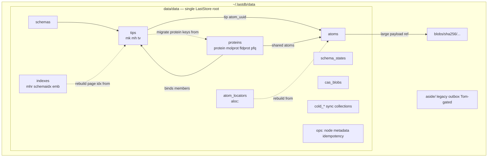
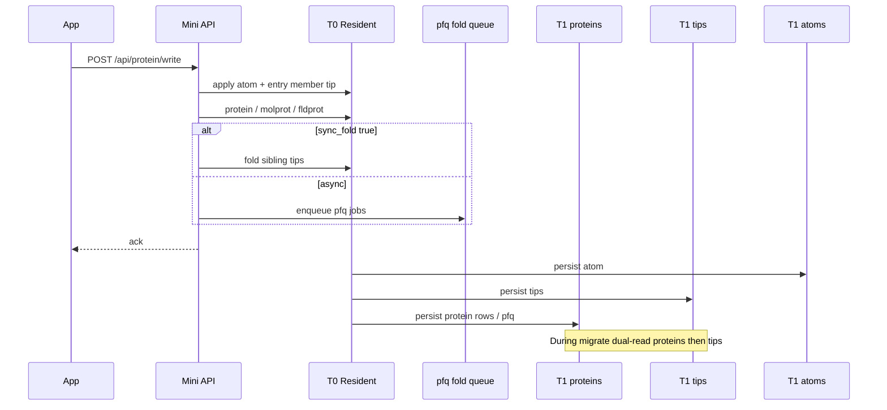
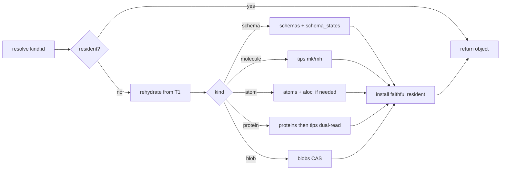
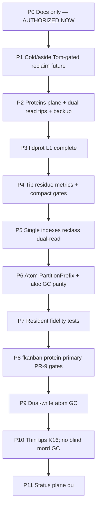

# Ideal LastDB On-Disk / Collection Shape (with Proteins)

| Field | Value |
|-------|--------|
| **Status** | **Approved — ship track open (rev 3)** — Tom 2026-07-29 (“drive it”) |
| **Date** | 2026-07-29 |
| **Owner** | Tom / EdgeVector |
| **Author** | Design (agent) |
| **Type** | Target architecture / ideal home layout |
| **North Star** | `north-star-lastdb-ideal-storage-shape` (Mode: ship) |
| **First milestone** | `milestone-lastdb-ideal-storage-proteins-plane` |
| **Authorized now** | **Ship track open** — start with proteins-plane foundation (PR-1 + PR-3 + PR-4); later PRs via further milestone requests |
| **Depends on** | Storage-v2 HashGroup engine already shipped |
| **Canonical model** | `concepts-lastdb-canonical-model` · `docs/lastdb-canonical-model.md` |
| **Workspace mirror** | `~/code/edgevector/docs/lastdb-ideal-storage-shape.md` (keep in sync when practical) |
| **In-tree (this repo)** | `docs/lastdb-ideal-storage-shape.md` — **source of truth for implementers** |

---

## Milestone contract: proteins-plane foundation

**Board:** `milestone-lastdb-ideal-storage-proteins-plane` · North Star `north-star-lastdb-ideal-storage-shape`  
**This doc PR:** design only — **no routing code** (implementation = follow-up cards `lastdb-proteins-plane-key-routing`, `lastdb-proteins-plane-backup-queue-cow-proof`).

### Collection ownership

| Collection | Role |
|------------|------|
| **`proteins`** | **SOT** for protein membership + fold queue (new write target) |
| **`tips`** | Legacy dual-read home for the same prefixes during migrate only |

### Key families (must classify → `proteins`)

| Prefix | Meaning |
|--------|---------|
| `protein:{uuid}` | Protein record (member list) |
| `molprot:{molecule_uuid}` | Member molecule → protein uuid backref |
| `fldprot:{field_hash}` | Field-hash auto-protein registry → protein uuid |
| `pfq:{…}` | Enqueued fold jobs (sibling tip repoint) |

### Read / write routing (contract for next PR)

| Op | Required behavior |
|----|-------------------|
| **put** | Write target = **`proteins`** for the four prefixes above |
| **get / exists / scan** | Dual-read order: **`proteins` → `tips`** (legacy tips-only rows remain readable) |
| **delete** | Delete across dual-read collections for that key (same as other main-key dual-reads) |
| **fold queue drain** | `pfq:` scan must include **`proteins`** (+ `tips` during migrate) |

### Backup / migration

- **`proteins` must be on the Mutable backup collection list** before treating proteins as the sole home for membership.
- Background copy-verify of `protein:` / `molprot:` / `fldprot:` / `pfq:` out of `tips` is allowed; until copy-verify complete, dual-read stays on.
- Never thrash primary first: **CoW / isolated Mini** for proof (terminal card `proof-lastdb-ideal-storage-proteins-plane`).

### Terminal proof shape (product, not unit tests alone)

On an isolated data dir or CoW of real data (not primary writes):

1. Create protein + add member + write(+fold) → keys land under **`proteins/`**.
2. Seed or retain **tips-only** rows for the same prefixes → **get still succeeds** via dual-read.
3. Mutable backup manifest **includes `proteins`**.
4. Capture evidence on the proof card; then milestone can complete.

### Map to implementation cards

| Card | Delivers |
|------|----------|
| `lastdb-proteins-plane-design-doc` (this PR) | This document in-tree |
| `lastdb-proteins-plane-key-routing` | `classify_main_key` + dual-read matrix for the four prefixes |
| `lastdb-proteins-plane-backup-queue-cow-proof` | backup_manifest + fold scan + CoW harness evidence |
| `proof-lastdb-ideal-storage-proteins-plane` | Terminal validation PASS |

Full plane taxonomy, tip residue, indexes, fkanban dual-write retirement, and atom PartitionPrefix are **later** sections / milestones — not required to complete this foundation milestone.

---

## Overview

LastDB Mini’s storage **engine** is storage-v2: hash-sharded LastStore segment files under `data/<collection>/0/g/<group>/<seg>.seg` with `layout_epoch=2`, `HashGroup key=PartitionPrefix`, `groups=1024`, `packaging=Plain`. That engine is correct.

The **home shape** is not. The live primary inventory pinned on **2026-07-29** (`~/.lastdb`, ~17 GiB data-dir) still carried **exactly 33** LastStore collections that were a 1:1 promotion of every old Sled tree/prefix — inventory residue from mini-cutover, not the ideal model. Operators saw dual tip **homes** (`tips` + `field_tips` residue), multi-hundred-meg derived indexes next to SOTs, and multi-gigabyte sync/meta mixed under `data/data/`. Treat this paragraph and the inventory table below as a dated historical snapshot; refresh against the primary before deriving new migration work.

This document defines the **ideal on-disk / collection shape with proteins as first-class**, so every later migration PR has a concrete target: which collections are source-of-truth vs rebuildable vs history/sync-adjacent vs cold/ops; where protein records live and how to dual-read them out of `tips`; how one tip plane absorbs legacy residue; how atoms + CAS and schemas catalog sit; how dual-write apps map onto proteins; and a phased, non-destructive migration compatible with CoW / `lastdb-safe-upgrade`.

---

## Background & Motivation

### Current state (live primary, inventory pin 2026-07-29)

| Metric | Value |
|--------|--------|
| Home | `~/.lastdb` |
| Data dir | ~**17.31 GiB** (`lastdb status`, 2026-07-29) |
| Layout | HashGroup · PartitionPrefix · epoch=2 · groups=1024 · packaging=Plain |
| Warm set | 4.00 GiB budget, ~100% warm; cold_shard_loads high under kanban query |
| Collections under `data/data/` | **exactly 33** (`ls data/data/`) |
| Sync | **disabled** (`lastdb status`: Sync: disabled) |
| Atom content cap (live) | `max_atom_content=524288` B (default 65536; abs max 1 MiB) |

**Inventory command (refresh before migration PRs):**

```bash
lastdb status
ls -1 ~/.lastdb/data/data/ | wc -l
du -sh ~/.lastdb/data/data/* | sort -hr
# When available against socket:
# lastdb db inventory   # row counts per collection/prefix — re-pin before compact PRs
```

Approximate `du` (largest; same day):

| Collection | ~Size | Class today |
|------------|------:|-------------|
| `atoms` | **12G** | SOT (immutable bodies) |
| `sync_capture` | **1.3G** | Sync/meta cold (**safe reclaim candidate while sync disabled**) |
| `field_tips` | **1.2G** | Historical tip residue at this pin; `mk:` live dual-read was later pruned after zero-hit soak |
| `sync_outbox.aside-legacy-20260723T224347Z` | **944M** | Aside / dead cold |
| `tips` | **542M** | Tip plane **write target** for `mk:`/`mh:`/`tv:` + unknown prefixes (incl. protein keys) |
| `field_update_order_log` | **353M** | History/sync-adjacent (append-only; not trivially rebuildable) |
| `field_hashrange_page_index` | **274M** | Derived (rebuildable from `mk:`) |
| `native_index` | **105M** | Derived local search |
| `field_tip_versions` | **52M** | Tip history |
| `schemas` + `schema_index` + `schema_states` | ~85M | Catalog + derived |
| `cas_blobs` | **27M** | CAS refs / small CAS |
| `atom_locators` | **13M** | Partition-locality locator (`aloc:` keys) |
| others | small | ops / identity / markers |

**Logical scale (order of magnitude only — not re-counted this rev):** ~**543k** atoms, ~**840k** tips-class rows, ~**1.4M** field_tips-class historical dual-plane mass. Treat as directional; re-pin with `lastdb db inventory` before compact PRs.

### Shipped write/read routing (important correction)

**Write target is `tips`.** Leftover tip homes (`field_tips`, `field_tip_headers`,
`field_tip_versions`) are residue. Do not treat those names as a second write
plane.

`LogicalMainLastStoreKvStore` (`storage/laststore/logical_main.rs`):

| Op | Behavior |
|----|----------|
| **put** | **Write-one** to `main_collection_for_key` only (`classify_main_key` or **`unwrap_or("tips")`**) |
| **get / exists / scan** | **Dual-read** target collection then legacy split collection(s) from `MAIN_KEY_PREFIX_COLLECTIONS` |
| **delete** | Delete across all dual-read collections for that key |

Implications:

1. **Tip dual-plane is residue + dual-read, not dual-write.** New `mk:`/`mh:`/`tv:` puts go to **`tips` only**. The 2026-07-29 pin still showed `field_tips`, but the `mk:`/`field_tips` live fallback was pruned on 2026-07-31 after primary inventory showed it absent and legacy hits stayed zero. Remaining live tip residue is `mh:` / `tv:` via headers/versions.
2. **Derived prefixes (`mhr:`, `mord:`, …) currently write to `tips`** (per `classify_main_key` → `"tips"`), while dual-read also checks legacy split collections (`field_hashrange_*`, `field_update_order_*`, …).
3. **Protein keys (`protein:`, `molprot:`, `fldprot:`, `pfq:`) are not classified** → put/get target **`tips`** via unknown-prefix fallback. There is no `proteins/` collection on the live home; membership that exists lives (or will live) under `tips`.
4. **Atom locators use `aloc:`**, not `loc:`. Shipped binary maps `aloc:` → collection `atom_locators` (see `atom_locator_codec` / MAIN_KEY routing in Mini `lastdbd`).

### How we got here

1. **Sled era:** one `main` tree held `atom:`, `mk:`, `mh:`, `tv:`, `mord:`, `mhr:`, … plus separate trees for schemas, sync, native_index.
2. **Mini cutover inventory** (now archived under `docs/history/mini-cutover/`) listed every tree/prefix so LastStore could host them without rediscovery.
3. **Storage-v2 promotion** mapped each tree/prefix → its own collection via `MAIN_KEY_PREFIX_COLLECTIONS` and dual-read legacy collections for gets.
4. **Canonical tip target:** `mini_cutover/main_keys.rs` classifies tip-class *and* many derived prefixes into **`tips`**. Leftover tip homes (`field_tips`, `field_tip_headers`, `field_tip_versions`) are residue, not write targets.
5. **Proteins shipped** (fold PR #914, field_hash auto-protein #927) as API + ops, but keys fall into **`tips`** until a proteins plane is classified and dual-read.

### Pain points

- **Ops:** “Why is my disk big?” cannot be answered with a clean `du` story (SOT vs rebuildable vs history vs cold).
- **Warmset thrash:** tip walk locality (PartitionPrefix, fanout=16) does not match atom body placement (`atom:{uuid}` scatters across all 1024 groups) — see `design-lastdb-atom-key-partition-locality`.
- **Dual tip homes:** get dual-reads `tips` + headers/versions for `mh:` / `tv:`; `mk:` no longer falls through to `field_tips`. **Writes already target `tips` only**. Backup still lists legacy tip collections (`backup_manifest.rs` MUTABLE_BACKUP_COLLECTIONS). Compact of remaining residue is the work—not inventing dual-write.
- **Derived weight in tips + legacy:** order logs + page indexes live as legacy collections *and/or* under `tips`; backed up / captured like truth.
- **Protein SOT mixed into tips:** membership + fold queue share tip traffic, warmset, and backup role with tips; no separate backup inventory entry for proteins.
- **Dual-write tax:** fkanban Card + BoardCards + MilestoneCards still dual-write as fallback; partial protein path can still write multiple proteins / soft-fail to dual-write.
- **Resident ↔ disk mismatch risk:** rehydrate fidelity law requires isomorphic ladder persist (`concepts-lastdb-rehydrate`).

---

## Goals & Non-Goals

### Goals

1. Define an **ideal collection map** aligned with the canonical ladder: Schema → Field → Molecule → Atom → File; Protein binds molecules.
2. Make **proteins first-class on disk** (records, molprot, fldprot, fold queue) with dual-read out of `tips` during migrate.
3. Collapse tip **homes** to **one tip plane** (not dual `tips` + `field_tips` residue).
4. Classify every of the **33 live collections** as **SOT | rebuildable-from-SOT | history/sync-adjacent | cold/ops** with an explicit decision procedure (prefix table).
5. Specify **atoms + CAS** placement (partition-local keys, `aloc:` locators, size fence, blob refs) and **schemas catalog** split.
6. Show how this **retires app dual-write** for multi-key products, with two protein layers (field-hash vs app multi-key) reconciled.
7. Provide a **phased, non-destructive migration** from 33 collections → ideal, CoW / safe-upgrade compatible.
8. Give operators a **target `du` story**.
9. Preserve Dynamo access law: O(1) point, O(log M) range under one hash, **no scan**.

### Non-Goals

| Non-goal | Why |
|----------|-----|
| Re-open sled as product store | Engine left sled; do not regress |
| Invent SQL scan / field-equality filters | `requirement-lastdb-access-complexity` |
| Implement full migration in one PR | Phased; this is target shape |
| Change LWW tip semantics or invent new CRDT | Existing tip LWW + protein fold |
| Make cloud required for local durability | T2 is eventual only |
| Arbitrary molecule graphs | Protein membership only |
| Collapse multi-key layouts into one key | `preference-schema-expand-same-product-different-keys` |
| Force full DB rehydrate at open | Lazy rehydrate |
| Redesign encryption-at-rest threat model | Keep ENC/seals; packaging may be plain on primary |
| Touch deprecated fold_db_node / desktop DMG product | Active fence |
| Restart primary brain to “prove” layout | CoW probe first; Tom-gated live cutover only |
| Claim order-log is rebuildable from tips without a proof | History/sync-adjacent until deprecation criterion exists |

---

## Proposed Design

### 1. Ideal home tree (operator view)

```text
~/.lastdb/
  current/                          # RUN binaries (host-track / lastdb-current)
  data/
    folddb.sock                     # UDS control/data plane
    laststore-layout-v1             # layout_mode, epoch, fanout, packaging
    manifest.json                   # optional: store_uuid, generation, plane inventory
    data/                           # SINGLE LastStore collections root (Phase-1)
      # ── T1 SOT (hot) ──────────────────────────────────────────
      schemas/                      # declarative catalog docs
      schema_states/                # availability / block / pin state
      tips/                         # ONE tip plane — on-disk name stays `tips` forever (K17)
                                    #   logical vocabulary: molecules; mk:, mh:; tv: thin/off by default (K16)
      proteins/                     # protein:, molprot:, fldprot:, pfq:  (NEW — migrate out of tips)
      atoms/                        # immutable atom bodies (partition-local keys target)
      # ── T1 derived (rebuildable where code exists) ────────────
      indexes/                      # SINGLE collection (K18): mhr/mhk/mhi, schemaidx, emb (+ mord home if moved)
      # ── T1 locality helpers ───────────────────────────────────
      atom_locators/                # aloc:{uuid} → partition (uuid-only GET path)
      # ── CAS metadata ──────────────────────────────────────────
      cas_blobs/                    # small CAS metadata / sealed refs
      # ── cold-class collections (same root; warm-priority excluded) ──
      cold_sync_capture/            # or keep name + tag; see K13
      cold_sync_outbox/
      cold_sync_cursors/
      cold_sync_conflicts/
      cold_change_feed/
      cold_share_delivery_outbox/
      # ── ops (same root) ───────────────────────────────────────
      metadata/
      node_config/
      node_identity/
      public_keys/
      idempotency/
      app_identity_consent_requests/  # rename from colon name if possible
      org_sync_targets/
      __at_rest_strict_markers/
    aside/                          # NOT auto-migrated: quarantined dumps (legacy outbox)
      sync_outbox.aside-legacy-20260723T224347Z/   # Tom-gated one-shot delete after backup receipt
    blobs/
      sha256/<hh>/<hh>/<hash>       # file-scale content-addressed bytes
```

**Physical grammar (unchanged engine):** each collection still:

```text
data/data/<collection>/0/g/<group>/<seg>.seg + keys-v1.idx
```

**K13 — Cold plane Phase-1 decision:**  
**Phase-1 cold = namespaced collections under the same LastStore data root** (`cold_*` rename **or** keep existing names + warm-priority / backup-role tags). **Not** a second LastStore root in Phase-1 (that is a factory/path layout change deferred to Phase-2 optional). Aside dumps stay as directory-level quarantine under `data/aside/` or left in place until Tom-gated delete—**not** part of automatic migrate.

### 2. Logical planes + decision procedure

| Plane | Collections | Role | Loss on delete |
|-------|-------------|------|----------------|
| **Catalog SOT** | `schemas`, `schema_states` (+ optional `schema_superseded_by`) | Schema definitions + runtime state | Irrecoverable without export |
| **Molecule / tip SOT** | `tips` (logical molecules) | `mk:`, `mh:`, optional `tv:` per policy | Irrecoverable — *the* indexes into atoms |
| **Protein SOT** | `proteins` | `protein:`, `molprot:`, `fldprot:` | Irrecoverable membership; tips/atoms remain but multi-key coherence lost |
| **Fold queue** | `proteins` (`pfq:`) | Durable until drain | Loss of in-flight sibling fold — **OK only if re-derivable from dirty entry tips / re-fold** (see prefix table) |
| **Atom SOT** | `atoms` | `atom:…` bodies | Irrecoverable values |
| **CAS** | FS `blobs/` + `cas_blobs` | Large payloads by hash | Irrecoverable blobs; atoms keep dangling refs |
| **Rebuildable indexes** | `indexes` | page index, schema_index, native_index, `aloc:` rebuild | Rebuildable from SOT with **named** algorithms |
| **History / sync-adjacent** | order log, tip versions, mutation_history | Append-only / chain | **Not** “rebuild from tips” without proof; retain or explicit deprecation |
| **Locality** | `atom_locators` | `aloc:` uuid → partition | Rebuildable from atom storage keys |
| **Cold / sync** | `cold_*` / tagged sync collections | capture, outbox, cursors, conflicts | Ops loss; not product SOT |
| **Ops / identity** | node/config/idempotency/markers | Node-local | Re-bootstrapable with care |

#### Decision procedure (apply per prefix)

For each key prefix, fill:

| Field | Question |
|-------|----------|
| **rehydrate kind?** | schema / molecule / atom / protein / blob / none (index-only) |
| **loss consequence** | product data loss / multi-key drift / slower path / ops only |
| **rebuild algorithm** | named fn in codebase, or **none** |
| **class** | SOT / rebuildable / history-sync-adjacent / cold / ops |

**Source-of-truth rule:** if rehydrate cannot reconstruct the resident ladder object without scanning the universe **and** no rebuild algorithm exists, that plane is **SOT** (or history-adjacent durable).

### 3. Collection map — live 33 → ideal (complete)

Exact live names under `~/.lastdb/data/data/` (2026-07-29):

| # | Live collection | Ideal home | Class | Backup role |
|---|-----------------|------------|-------|-------------|
| 1 | `atoms` | `atoms` | SOT | Atom (immutable) |
| 2 | `tips` | `tips` (logical molecules) | SOT tips + **temporary host** of protein/derived until reclass | Mutable |
| 3 | `field_tips` | collapse → `tips` then aside | Residue (not a write target) | Mutable compat → drop after compact |
| 4 | `field_tip_headers` | `mh:` in `tips` | Residue | Mutable compat → drop |
| 5 | `field_tip_versions` | `tv:` in `tips` or history policy | History-adjacent | Mutable |
| 6 | `field_update_order_log` | `indexes` **or** history plane | **History/sync-adjacent** (not rebuildable from tips alone) | Mutable until deprecation |
| 7 | `field_update_order_count` | with order log | History-adjacent | Mutable |
| 8 | `field_hashrange_page_index` | `indexes` (`mhr:`) | Rebuildable (`rebuild_hash_range_page_index`) | Derived optional |
| 9 | `field_hashrange_hash_index` | `indexes` (`mhk:`) | Rebuildable | Derived optional |
| 10 | `field_hashrange_complete` | `indexes` (`mhi:`) | Rebuildable marker | Derived optional |
| 11 | `schemas` | `schemas` | SOT | Mutable |
| 12 | `schema_states` | `schema_states` | SOT | Mutable |
| 13 | `schema_index` | `indexes` | Rebuildable (admin) | Local/derived |
| 14 | `legacy_schema_secondary_index` | `indexes` or delete after schema_index health | Legacy derived | Local |
| 15 | `native_index` | `indexes` (or keep name) | Rebuildable (search-rebuild) | Local; plaintext-by-policy |
| 16 | `atom_locators` | `atom_locators` | Rebuildable helper | Local |
| 17 | `cas_blobs` | `cas_blobs` | CAS metadata SOT | Mutable / CAS |
| 18 | `legacy_blob_refs` | cold/aside or GC via `lastdb db purge-ref-blobs` (safe only when per-key `mh:`/`mk:` rehydrated; CoW first) | Legacy | Optional |
| 19 | `sync_capture` | cold-class (`cold_sync_capture` or tag) | Cold | **Separate / optional** (not user ladder SOT) |
| 20 | `sync_outbox.aside-legacy-20260723T224347Z` | `aside/` → **Tom-gated delete** | Dead cold | Backup receipt then delete |
| 21 | `sync_cursors` | cold-class | Cold | Optional |
| 22 | `sync_conflicts` | cold-class | Cold | Optional |
| 23 | `sync_file_blob_known` | cold-class | Cold | Optional |
| 24 | `change_feed` | cold-class or drop if unused | Cold | Optional |
| 25 | `share_delivery_outbox` | cold-class / ops | Cold/ops | Optional |
| 26 | `metadata` | ops | Ops | Local |
| 27 | `node_config` | ops | Ops | Local (sensitive) |
| 28 | `node_identity` | ops | Ops | Local (sensitive) |
| 29 | `public_keys` | ops | Ops | Mutable/local |
| 30 | `idempotency` | ops | Ops | Local |
| 31 | `app_identity:consent_requests` | ops — **colon in name is a LastStore naming hazard**; prefer rename to `app_identity_consent_requests` on touch | Ops | Local |
| 32 | `org_sync_targets` | ops | Ops | Local |
| 33 | `__at_rest_strict_markers` | ops | Ops | Local |

**Not on live disk but code may open:** `schema_atom_index`, `mutation_history`, `field_update_order_legacy`, `schema_superseded_by`, logical `main` — treat as legacy dual-read targets in routing tables.

**Missing today → ideal:** collection **`proteins`** (SOT, **Mutable backup required** before treating as sole home).

### 4. Protein on disk (first-class) + migration out of `tips`

#### Key shapes (authoritative prefixes; confirmed in Mini `lastdbd` strings / protein ops)

| Key | Ideal collection | Meaning |
|-----|------------------|---------|
| `protein:{uuid}` | `proteins` | Protein record: uuid, member list, markers |
| `molprot:{molecule_uuid}` | `proteins` | Backref → protein uuid |
| `fldprot:{field_hash}` | `proteins` | Field-hash auto-protein registry → protein uuid |
| `pfq:{…}` | `proteins` | Fold job queue |

Authoritative codec homes (when present in tree): `fold_db/crates/core/src/protein/keys.rs`, `field_hash_coherence.rs`, `protein/ops.rs`.

#### Current routing reality

```text
classify_main_key("protein:…") → None → unwrap_or("tips")
put → tips only
get  → tips (no legacy split for protein prefixes)
```

#### Migration contract (PR-proteins — blocking)

1. **Classify** `protein:` / `molprot:` / `fldprot:` / `pfq:` → write target **`proteins`**.
2. **Dual-read order:** `proteins` **then** `tips` (until copy-verify complete).
3. **Background copy** of those prefixes from `tips` → `proteins`; verify sample gets + counts.
4. **`protein_process_folds` / `scan_items_with_prefix("pfq:")`** must open the **proteins** plane (and dual-read `tips` during migrate)—must not rely on tips-only scan after cutover.
5. **Before** treating proteins as sole SOT: add **`proteins` to `MUTABLE_BACKUP_COLLECTIONS`** in `backup_manifest.rs`.
6. Drop dual-read only when legacy hits for protein prefixes are zero on CoW for N days.

#### Invariants

1. **Bi-directional:** every member molecule’s `molprot:` points at the protein; protein member list includes that molecule.
2. **One shared atom set:** members are tips into the **same** atom UUIDs, not dual-written value copies (`concepts-lastdb-protein-write-fold`).
3. **No canonical member:** protein UUID is identity; members are peer conformations (key layouts).
4. **Both keys stay addressable** for multi-key expand; protein never collapses layouts.
5. **Fold is tip fan-out, not rehydrate:** resident fold first; dirty tips persist to tip plane.
6. **`pfq:`:** durable until drain; loss OK **only if** sibling fold can be re-derived from entry-member dirty tips / re-issue fold job. Crash-safe drain preferred before compact that drops `pfq:`.

### 5. Two protein layers (field-hash vs app multi-key)

Do not treat “protein API available” as equivalent to “single coherent protein per shared field.”

| Layer | Identity | Storage | Owner | Status |
|-------|----------|---------|-------|--------|
| **L1 — Field-hash auto-protein** | `field_hash = H(name, description, type, version)` (Schema Service) | `fldprot:{field_hash}` → protein uuid; members = field molecules across schemas | Core / Mini | design-lastdb-field-hash-auto-protein; partial ship |
| **L2 — App multi-key membership** | App-chosen member layouts (e.g. BoardCards `board`/`sk` vs MilestoneCards `milestone`/`sk`) | Same protein machinery; may create/adopt proteins per field molecule pair | App (fkanban `protein.ts`) | Shipped with dual-write fallback |

**Shipped fkanban behavior (accurate):**

- Per shared field: create/adopt protein, try bind board + milestone molecules.
- On **“already bound to different protein”**: may write **both keys explicitly on separate proteins** (same content-addressed atom UUID, **not** one fold-owned set).
- Soft-fails to **app dual-write** if protein path incomplete / re-list disagree.

**Ideal end state:**

1. L1 binds all molecules that share a field_hash into **one** protein when key layouts differ only by schema KeyConfig.
2. L2 uses L1 proteins (or a single app-managed protein set) for BoardCards↔MilestoneCards; **no permanent dual-protein write path**.
3. Card primary (slug-keyed) molecules: **decision** — prefer **not** forced into membership proteins; membership indexes are peer members of the thin-field proteins. (Resolved preference for PR-9 gate: **Card primary stays its own key layout; shared thin fields use L1 proteins across BoardCards/MilestoneCards.** Full entity-level “one protein for whole card” is **not** required for dual-write retirement.)

**PR-9 acceptance (remove dual-write fallback) requires all of:**

1. Mini always routes protein keys to durable **`proteins`** plane (dual-read from `tips` complete or empty).
2. Fold / `sync_fold` guarantees multi-key read agreement without partition re-list dual-write.
3. “Already bound to different protein” is **healed into one protein** (prefer L1 field_hash) — not left as silent dual-protein content writes forever.
4. CoW e2e: board list + milestone list agree after single write path.

### 6. Molecule / tip plane (single home)

#### Canonical prefixes in tip plane (`tips` / logical molecules)

From `molecule_key_codec.rs`:

| Prefix | Role | Class |
|--------|------|-------|
| `mk:{M}:{esc(hash)}\0{range}` | Per-key tip → atom_uuid | **SOT tip** |
| `mh:{M}` | Molecule header | **SOT header** |
| `tv:{version_id}` | Archived tip version | **History-adjacent** (policy) |

#### Shipped vs remaining work

| Already shipped | Remaining |
|-----------------|-----------|
| put `mk:`/`mh:`/`tv:` → **`tips` only** | Metrics: `dual_read.legacy_hits` per prefix |
| get dual-read `tips` then headers / versions for `mh:` / `tv:`; `mk:` reads `tips` only | **Copy-verify** remaining headers/versions residue → `tips`; `field_tips` is pruned from the live lookup path |
| Tests assert new rows not written to `field_tips` | Aside empty legacy collections; drop dual-read |
| | Backup list hygiene (stop listing empty field_tips*) |
| | ~~Rename `tips` → `molecules`~~ — **wontfix / not planned** (K17: keep `tips` forever) |

**Do not invent dual-write to field_tips.**  
**On-disk collection name stays `tips` forever** (logical docs may say “molecule plane”).

#### History policy — **Settled K16 (Tom 2026-07-29): Thin tips**

| Policy | Behavior | Status |
|--------|----------|--------|
| **A. Thin tips** | Live tip on `mk:` only; **drop / aggressively trim** `tv:` chains; tip version history **off by default** on Mini | **Settled — Mini default** |
| **B. Full tip chain** | Keep all `tv:` | Rejected for Mini default |
| **C. History sidecar** | Live tips in `tips`; `tv:` elsewhere | Not planned |

Implementation of thin tips (retention / GC of existing `tv:` / `field_tip_versions`) is a **future** storage PR (roadmap PR-11), not authorized until after docs landing. Order log (`mord:`/`moc:`/`mo:`) is **not** covered by tip thinning alone — see §8.

### 7. Atoms + CAS

#### Atom size fence

- Default content fence: **64 KiB** serialized; env `LASTDB_MAX_ATOM_CONTENT_BYTES`; absolute max **1 MiB**.
- Live primary: `max_atom_content=524288`.
- File-scale payloads → **CAS blobs**; atom holds ref.

#### Storage keys (partition locality)

From `design-lastdb-atom-key-partition-locality`:

| Encoding | Key | Status |
|----------|-----|--------|
| Flat (shipped default) | `atom:{uuid}` | Live today — scatters bodies |
| PartitionPrefix | `atom:mk:{M}:{esc(hash)}\0{uuid}` | Target for tip-driven co-locality |
| Unknown partition | `atom:{uuid}` | Defined orphan/GC placement |

#### Atom locators — prefix `aloc:` (not `loc:`)

| Item | Value |
|------|-------|
| **Prefix** | **`aloc:`** |
| **Collection** | `atom_locators` |
| **Shape** | `aloc:{atom_uuid}` → partition prefix / storage key material |
| **Authoritative codec** | `fold_db/crates/core/src/atom/atom_locator_codec.rs` (`LOCATOR_PREFIX = "aloc:"`) when present in tree; confirmed in Mini binary routing `aloc:` → `atom_locators` |
| **Use** | **Only** uuid-only `GET /api/atom/{uuid}` (lastgit packs, etc.) |
| **Tip-driven path** | No hop — partition known from `mk:` walk |

#### CAS

```text
blobs/sha256/<hh>/<hh>/<hash>     # large bytes on filesystem (SOT for blob bytes)
cas_blobs/                        # LastStore collection for refs/metadata / small CAS
```

**Boundary:** atom content never multi-MB; `cas_blobs` may hold delivery/CAS payloads under policy (`LASTDB_ALLOW_PLAIN_CAS` etc.). FS `blobs/` is the long-term file-scale home.

#### Dedup trade-off

Partition-prefix scopes content dedup to the partition. Measure on CoW before flip.

### 8. Derived / history indexes — honest classification

#### Rebuildable from SOT (named algorithms exist)

| Index | Keys | Rebuild | Notes |
|-------|------|---------|-------|
| HashRange page index | `mhr:`, `mhk:`, `mhi:` | `rebuild_hash_range_page_index` from `mk:` tips | Real path in `atom_store/filter/page_index.rs` |
| native_index | `emb:`, `graveyard:emb:` | search-rebuild jobs | Local; plaintext-by-policy |
| atom_locators | `aloc:` | from atom storage keys | After PartitionPrefix migrate |
| schema_index | `schemaidx:` | admin purge/rebuild paths | Not product list path |

#### History / sync-adjacent (retain or explicit deprecation — **not** “rebuildable from tips”)

| Material | Keys | Why not “rebuildable” as stated |
|----------|------|----------------------------------|
| Update order log | `mord:`, `moc:`, `mo:` | Append-only durable log; `replay_order_log_entry`; immutable `mord:{M}:{seq}` slots; used by mutation/sync order semantics. **No** `rebuild_order_log_from_tips` equivalent to page-index rebuild |
| Tip versions | `tv:` | Chain for as-of / history; policy A/B/C |
| mutation_history | `history:` | Legacy; prefer tip-version chain |

**Safe-to-drop criterion for order log (must be written before GC PR):**

> Order log may be GC’d only when CoW proof shows HashRange list/order product paths that still need order semantics either (a) no longer read `mord:`/`moc:`, or (b) can reconstruct required order from another durable SOT without scan. Until then: **move collection home only**, do not delete.

**Do not** put order-log GC in the same PR as page-index collection move.

#### Dual-read matrix when reclassifying derived → `indexes`

Current write home for `mhr:`/`mord:`/… is often **`tips`** (classify → tips), with dual-read of legacy split collections.

**PR-indexes dual-read order (mandatory):**

```text
indexes  →  tips  →  legacy split collection for that prefix
```

Copy-verify must seed/test rows in **all three** locations. Update `classify_main_key` and `MAIN_KEY_PREFIX_COLLECTIONS` in the **same** PR.

### 9. Schemas catalog

| Collection | Contents |
|------------|----------|
| `schemas` | Declarative schema docs: fields, keying, field_hash, field→molecule UUID map |
| `schema_states` | Available / blocked / pin state |
| `schema_superseded_by` (optional) | Redirect old → new |
| `schema_index` / legacy secondary | **indexes**, rebuildable |

### 10. Sync / meta / outbox — cold class (K13)

| Live | Phase-1 treatment |
|------|-------------------|
| `sync_capture` (1.3G) | cold-class name or warm-priority exclude; **sync currently disabled** → reclaim/clarity low-risk if capture not needed for re-enable tests |
| `sync_outbox.aside-legacy-20260723T224347Z` (944M) | **Tom-gated one-shot** after backup receipt — **not** automatic migrate |
| `sync_cursors`, `sync_conflicts`, `sync_file_blob_known` | cold-class |
| `change_feed` | cold-class or drop |
| `share_delivery_outbox` | cold/ops |

**Invariant:** local mutation ack never waits on cold plane or cloud (T2).

**Re-enable sync:** document that cold-class rename requires dual-open or config alias so re-enable does not look for empty old paths.

### 11. Resident ↔ disk isomorphism

```text
T0 RESIDENT (primary)     T1 DISK (LastStore)           T2 CLOUD
─────────────────────     ────────────────────          ────────
schema catalog     ←→     schemas + schema_states
molecule tips      ←→     tips (mk/mh[/tv])
atoms              ←→     atoms (+ aloc: locators)
proteins           ←→     proteins (protein/molprot/fldprot)  [after migrate; tips during dual-read]
blob refs          ←→     blob hash in atom; bytes in blobs/
fold queue         ←→     pfq: until drain
```

**Fidelity invariant** (`docs/lastdb-rehydrate.md`): what is in resident is exactly what will be written later.

| Op | Role |
|----|------|
| `apply` | Mutate resident ladder |
| `persist` | Dirty → isomorphic disk records |
| `rehydrate` | Disk miss → install faithful object |
| `fold` | Protein tip fan-out on resident members |
| `evict` | Clean only |

### 12. How this retires dual-write

#### Today (interim)

```text
App write Card (slug) ──► primary tips+atoms
App dual-write BoardCards ──► second schema tips+atoms (copy)
App dual-write MilestoneCards ──► third schema tips+atoms (copy)
  OR protein path with possible dual-protein / soft dual-write fallback
Heal tools fix drift
```

#### Ideal

```text
L1: shared thin fields → field_hash protein (one atom set; board + milestone member tips)
L2: app write via protein/write + sync_fold
Card primary remains slug-keyed; not required inside membership protein
No app dual-write of value copies
After cutover: GC unreferenced dual-written atom copies (PR-GC)
```

### 13. Target `du` story (operator)

After ideal shape + Tom-gated aside delete + cold-class tagging + history policy A:

```text
$ du -sh ~/.lastdb/data/data/*
  ~10–12G   atoms
  ~1.0–1.5G tips          # single home after residue compact
  ~10–50M   proteins
  ~50–100M  schemas*
  ~100–400M indexes       # page idx, native; order log if retained
  ~10–20M   atom_locators
  ~30M      cas_blobs
  cold_*    (capture only if needed; aside gone)
```

| Action | Est. reclaim / clarity |
|--------|------------------------|
| Tom-gated delete aside legacy outbox | **~0.9G** |
| cold-class / drop capture while sync off | **~1.3G** or clarity |
| Collapse tip residue (compact) | Ops clarity; space after segment compact |
| Thin `tv:` / **not** blind mord GC | **~0.05–0.4G** class only with proof |
| Atom partition locality | Latency/warmset, not primarily bytes |
| Dual-write atom GC after protein cutover | Stops **future** dual growth; reclaim needs **PR-GC** |

---

## Prefix → plane table (authoritative for implementers)

| Prefix | Ideal plane | Dual-read order during migrate | Class | Rebuild / notes |
|--------|-------------|--------------------------------|-------|-----------------|
| `atom:` | atoms | atoms | SOT | — |
| `aloc:` | atom_locators | atom_locators | rebuildable | rebuild from atom keys |
| `mk:` | tips | **tips only** (`field_tips` residue; live fallback pruned 2026-07-31) | SOT | write target is `tips` |
| `mh:` | tips | tips; leftover `field_tip_headers` is residue | SOT | write target is `tips` |
| `tv:` | tips | tips; leftover `field_tip_versions` is residue | history-adjacent | policy A/B/C |
| `mhr:`/`mhk:`/`mhi:` | indexes | indexes → tips; `field_hashrange_*` only via explicit drain | rebuildable | `rebuild_hash_range_page_index` |
| `mord:`/`moc:`/`mo:` | indexes or history | indexes → tips → field_update_order_* | **history-sync-adjacent** | **no tips-only rebuild** |
| `history:` | history/cold | tips → legacy | history | prefer tv: |
| `ref:` | cold/legacy | tips → legacy_blob_refs | legacy | CoW purge: `lastdb db purge-ref-blobs` deletes only keys with per-key coverage; blocked sole-copy residue stays |
| `schema_atoms:` / `idx:` | indexes | indexes → tips → schema_atom_index | rebuildable/legacy | |
| `schemaidx:` | indexes | indexes → tips (legacy_schema_secondary_index retired from live dual-read; CoW drain still drops the collection) | rebuildable | |
| `conflict:` | cold | cold → tips → sync_conflicts | cold | |
| `protein:` | proteins | **proteins → tips** | SOT | — |
| `molprot:` | proteins | **proteins → tips** | SOT | — |
| `fldprot:` | proteins | **proteins → tips** | SOT | — |
| `pfq:` | proteins | **proteins → tips** | durable queue | re-fold if lost |
| `emb:` / `graveyard:emb:` | indexes / native_index | native_index | rebuildable | search-rebuild |
| `wm:` etc. | cold sync | sync_capture | cold | |
| `entry:` (outbox) | cold | sync_outbox | cold | |

---

## Architecture Diagrams

### Ideal collection map



### Write path with protein fold



### Rehydrate ladder



### Migration phases



**Note:** tips→molecules rename is **cancelled** (K17). P1–P11 are roadmap only until Tom opens a ship track.

---

## API / Interface Changes

| Surface | Change |
|---------|--------|
| `/api/mutation`, `/api/query` | Unchanged product contract |
| `/api/protein*` | Durable keys in `proteins` after migrate; dual-read `tips` during |
| `/api/atom/{uuid}` | uuid-only via **`aloc:`** locator when PartitionPrefix on |
| `/api/schema/*` | field_hash / molecule uuids for L1 auto-protein |

### Plane constants (conceptual)

```rust
const PLANE_SCHEMAS: &str = "schemas";
const PLANE_SCHEMA_STATES: &str = "schema_states";
const PLANE_TIPS: &str = "tips";           // on-disk forever (K17); logical name: molecule plane
const PLANE_PROTEINS: &str = "proteins";
const PLANE_ATOMS: &str = "atoms";
const PLANE_INDEXES: &str = "indexes";     // single collection (K18)
const PLANE_ATOM_LOCATORS: &str = "atom_locators";
const PLANE_CAS: &str = "cas_blobs";
const LOCATOR_PREFIX: &str = "aloc:";      // NOT "loc:"
```

---

## Data Model Changes

Logical ladder **unchanged**. On-disk ownership changes per prefix table.

### Migration strategy (non-destructive)

1. Dual-read windows; never silent key rewrite.
2. CoW / ephemeral probe before primary (`lastdb-safe-upgrade` spirit).
3. Copy active headers/versions residue into `tips`; a restored pre-prune home with old `field_tips` requires an explicit one-off compatibility plan, not the live lookup path.
4. **Copy protein prefixes tips → proteins** before dropping dual-read.
5. Derived: copy from **tips and legacy** into indexes.
6. Rollback: re-enable dual-read; do not delete aside until backup receipt + N stable days.

---

## Alternatives Considered

### Alternative 1: Keep ~33 collections; only document them

**Reject** as end state. Acceptable interim only.

### Alternative 2: Three collections only (`schemas`, `tips`, `atoms`) + FS blobs

**Partial accept:** three document SOTs plus explicit protein + indexes + cold + ops.

### Alternative 3: Separate index plane with covering pointers (pre-protein)

**Reject** — superseded by proteins.

### Alternative 4: Embed protein membership only in `mh:` headers

**Reject** as sole home; header cache optional.

### Alternative 5: Keep protein prefixes in `tips` forever (current de facto)

| Pros | Cons |
|------|------|
| Zero migration | Backup/warmset/`du` cannot separate membership SOT from tip churn |
| Matches today’s fallback | `pfq:` scans compete with tip traffic; protein loss mixed with tip compact mistakes |

**Reject** as end state. Strengthens **K3**: proteins need their own collection + Mutable backup role. Accept dual-read from `tips` only as migrate window.

---

## Security & Privacy Considerations

| Topic | Treatment |
|-------|-----------|
| At-rest encryption | Planes under encrypting store where policy requires; `native_index` plaintext-by-policy stays explicit |
| HashKey blind / RangeKey OPE | Orthogonal; codecs apply to `mk:` in tips |
| Protein records | Molecule UUIDs + key field names — node-local metadata |
| **Backup roles** | **Proteins → Mutable** (must be in `MUTABLE_BACKUP_COLLECTIONS`). Tips/schemas Mutable. Atoms Atom role. **Cold sync → optional separate / non-ladder backup class** so capture/outbox is not confused with user SOT restore |
| CAS blobs | Content-addressed; share layer for access control |
| Colon collection names | `app_identity:consent_requests` is a naming hazard; rename on touch |

---

## Observability

| Metric | Purpose |
|--------|---------|
| `resident.hit / rehydrate` by kind | T0 vs T1 |
| `protein.fold.latency / queue_depth` | Fold lag |
| `plane.bytes / plane.warm_groups` | Per-plane du + warmset |
| `dual_read.legacy_hits{prefix,collection}` | Migration progress (**per prefix**, per get) — must go to 0 |
| `atom_locator.miss` / `aloc` | Partition-prefix health |
| `index.rebuild.jobs` | Derived rebuild |

**Alerts:** legacy dual_read hits after declared complete; fold queue unbounded; cold size > SOT.

---

## Rollout Plan

### Principles

1. Design first → incremental PRs.
2. Durable backup → CoW GREEN → Tom-gated cutover.
3. Dual-read; no silent rewrite; no list-orphan delete on uncertain miss.
4. Mini release / `lastdb-safe-upgrade` between protein plane and app dual-write removal.

### Risks

| Risk | Severity | Mitigation |
|------|----------|------------|
| Protein migrate orphans membership in tips | **Critical** | Dual-read proteins→tips; copy-verify; backup proteins first |
| Derived reclass misses tips-hosted rows | **Critical** | Dual-read indexes→tips→legacy; tests seed all three |
| Dual-tip compact loses field_tips-only keys | High | Copy residue first; tips wins only when both present **after** copy |
| Atom prefix flip + GC empties atoms | **Critical** | PR-7 checklist: GC key parity, aloc fill before prefix-only GC, CoW |
| Order-log GC breaks HashRange order | High | History-adjacent; no GC without criterion |
| Blind dual-write atom GC | High | Content-hash agree + tip fold + CoW; link gc-atoms |

---

## Open Questions

1. ~~On-disk rename `tips` → `molecules`?~~ → **Settled (Tom 2026-07-29) / K17:** **Keep `tips` forever** on disk. Logical vocabulary may say “molecule plane.” PR-13 rename **cancelled / not planned**.
2. ~~History policy default for Mini?~~ → **Settled (Tom 2026-07-29) / K16:** **Thin tips** — drop / aggressively trim `tv:` chains; tip version history **off by default**.
3. ~~Single `indexes` vs subcollections?~~ → **Settled (Tom 2026-07-29) / K18:** **Single `indexes` collection** (mhr / schemaidx / emb share one collection).
4. ~~Cold physical root~~ → **Settled K13:** Phase-1 same root + `cold_*` or tags; Phase-2 optional second root.
5. **Mini release gate** between protein plane and fkanban dual-write removal — how many dogfood days? *(future; not blocking docs)*
6. ~~Field-hash vs entity proteins~~ → **Settled:** L1 field-hash for shared thin fields; Card primary not required in membership protein; PR-9 gates in §5.
7. **Order log long-term:** retain until safe-to-drop criterion proven — **not** “rebuild from timestamps” without code. *(still open for implementation phase)*
8. **Target atom size after dual-write GC** — measure on CoW, don’t guess. *(implementation phase)*

---

## Key Decisions

| # | Decision | Rationale |
|---|----------|-----------|
| K1 | Ideal shape is **plane taxonomy on LastStore HashGroup**, not a new engine | Engine done; inventory residue is the problem |
| K2 | **One tip home** (`tips`); leftover `field_tips` is residue, not a write target | Shipped LogicalMain put is write-one; `mk:` live fallback pruned 2026-07-31 |
| K3 | **Proteins are first-class SOT collection**; reject forever-in-tips (Alt 5) | Backup/warmset/du separation; pfq isolation |
| K4 | Split **rebuildable** (named fn) vs **history/sync-adjacent** (order log; former `tv:` weight) | Order log is not page-index-class rebuildable; thin tips drops `tv:` by default |
| K5 | Cold/sync/ops separated (tags or `cold_*`); aside is Tom-gated | Operator du; sync currently disabled |
| K6 | Atoms SOT; CAS for oversized; PartitionPrefix target; locators **`aloc:`** | Identity vs storage key; match shipped codec |
| K7 | Resident primary; disk isomorphic write-behind | rehydrate law |
| K8 | Multi-key apps use proteins; dual-write interim; **PR-9 multi-gate** | Retires drift; both keys stay addressable |
| K9 | Migration phased, dual-read, CoW-first, Tom-gated | Safe-upgrade |
| K10 | No scan / no SQL / no sled return | Access complexity |
| K11 | **Two protein layers:** L1 field-hash + L2 app multi-key; Card primary not forced into membership protein | Reconciles auto-protein with fkanban |
| K12 | Fold = tip fan-out; rehydrate = load | Distinct ops |
| K13 | **Phase-1 cold = same LastStore root** (`cold_*` or warm tags); not second root | Implementable without factory redesign |
| K14 | **Protein dual-read tips** until copy-verify; proteins on Mutable backup | Prevent orphan membership |
| K15 | Derived dual-read **indexes → tips → legacy** | Matches current write home tips |
| **K16** | **Thin tips (Mini):** drop / aggressively trim `tv:` chains; tip version history **off by default** | Tom 2026-07-29 — smaller tips plane; history not a Mini product default |
| **K17** | **Keep on-disk collection name `tips` forever**; no rename to `molecules` | Tom 2026-07-29 — avoid layout churn; logical docs may still say molecule plane |
| **K18** | **Single `indexes` collection** for mhr/schemaidx/emb (and optional mord home) | Tom 2026-07-29 — one derived home, prefix-separated keys |

---

## References

| Resource | Path / slug |
|----------|-------------|
| Canonical model | `docs/lastdb-canonical-model.md` · `concepts-lastdb-canonical-model` |
| Rehydrate | `docs/lastdb-rehydrate.md` · `concepts-lastdb-rehydrate` |
| Agent access | `docs/lastdb-agent-access-model.md` |
| Protein design | `design-lastdb-protein-molecule-set` |
| Protein write/fold | `concepts-lastdb-protein-write-fold` |
| Field-hash auto-protein | `design-lastdb-field-hash-auto-protein` |
| Atom key locality | `design-lastdb-atom-key-partition-locality` |
| Multi-key expand | `preference-schema-expand-same-product-different-keys` |
| Storage v2 spike | `spike-lastdb-storage-v2-sharded-segments` |
| Atom empty-via-GC lesson | brain `lastdb-atom-key-flip-would-have-emptied-the-atom-collection-via-gc` |
| Key codec | `fold_db/crates/core/src/atom/molecule_key_codec.rs` |
| Locator codec | `fold_db/crates/core/src/atom/atom_locator_codec.rs` (`aloc:`) |
| Collection routing | `fold_db/crates/core/src/storage/laststore/key_routing.rs` |
| Main key classify | `fold_db/crates/core/src/mini_cutover/main_keys.rs` |
| Backup manifest | `fold_db/crates/core/src/storage/laststore/backup_manifest.rs` |
| Page index rebuild | `fold_db/crates/core/src/db_operations/atom_store/filter/page_index.rs` |
| fkanban protein | host-track fkanban `src/protein.ts` |

---

## PR Plan

### Authorization (Tom 2026-07-29)

| Phase | Status |
|-------|--------|
| **Ship track** | **Opened 2026-07-29** — North Star `north-star-lastdb-ideal-storage-shape`; first milestone `milestone-lastdb-ideal-storage-proteins-plane`. |
| **PR-1 + PR-3 + PR-4** | **First milestone frontier** — docs in fold tree; proteins collection dual-read tips; backup; fldprot on proteins plane. |
| **PR-2, PR-5 … PR-12** | Later milestones (tip residue, indexes, fkanban protein-primary, atom GC, thin tips, status planes). |
| **PR-13** | **Cancelled / not planned** (K17: keep `tips` forever). |

**Each storage PR ships via fold CI; Mini adoption via `lastdb-safe-upgrade` with concurrency 1.** Cadence: at least one Mini dogfood release between proteins plane (PR-3) and fkanban dual-write removal (PR-9).

### PR-1: Document + plane constants (no behavior change) — **FIRST MILESTONE**

- **Title:** `docs: ideal LastDB collection/plane shape with proteins`
- **Files:** `docs/lastdb-ideal-storage-shape.md` (workspace); this design file kept in sync
- **Deps:** none
- **Description:** Land approved design (rev 3); document `aloc:`, dual-read matrices, K16–K18, Phase-0 docs-only scope. Plane name constants in code are **out of scope for Phase-0** unless a trivial docs-only constant table is desired later.
- **Exit:** workspace doc present and matches this design; agents cite it for ideal home shape.

### PR-2: Cold-class tagging + Tom-gated aside reclaim (ops) — *future*

- **Title:** `ops: cold-class sync collections + aside outbox delete procedure`
- **Files:** sync open paths / warm priority; maintain docs; optional `cold_*` rename dual-open
- **Deps:** PR-1
- **Description:** Implement K13 Phase-1 (same root). **Aside delete** of `sync_outbox.aside-legacy-20260723T224347Z` is Tom-gated one-shot with backup receipt—not automatic. Capture reclaim while Sync disabled is optional explicit step.
- **Exit:** aside gone or documented hold; status can attribute cold bytes.

### PR-3: Proteins collection + dual-read from tips + backup

- **Title:** `protein: proteins collection; dual-read tips; mutable backup`
- **Files:** `classify_main_key` / `MAIN_KEY_PREFIX_COLLECTIONS`; protein ops put/get/scan; `backup_manifest.rs` add `proteins`; fold queue scan
- **Deps:** PR-1
- **Description:** Write target `proteins`; dual-read **proteins → tips**; bg copy prefixes out of tips; `process_folds` scans proteins plane (+ tips during migrate).
- **Exit:** sample protein create/member/write/fold on CoW; backup list includes proteins; no orphan if tips still holds rows.

### PR-4: Field-hash auto-protein registry complete (`fldprot:`)

- **Title:** `protein: fldprot field_hash registry on proteins plane`
- **Files:** field_hash coherence; schema load bind; Mini
- **Deps:** PR-3
- **Description:** L1 complete; second schema same hash joins one protein.

### PR-5: Tip residue metrics + compact gates (not invent dual-write)

- **Title:** `storage: dual_read.legacy_hits metrics + field_tips copy-verify compact`
- **Files:** laststore dual-read counters; maintain copy job; backup list hygiene
- **Deps:** PR-1 (can parallel PR-3)
- **Description:** **Already shipped:** write-one tips and `mk:` no longer falls through to `field_tips` after the 2026-07-31 zero-hit primary soak. This PR adds metrics and **copy-verify** of remaining headers/versions residue into tips. Conflict policy: after copy, if both present **tips wins** (write target).
- **Exit (PR-10-style gates, can land here or follow-up):** zero `dual_read.legacy_hits` for `mh:`/`tv:` over N days on CoW; sample get equality; byte-count bounds; then aside empty field_tip_headers / field_tip_versions.
- **Operator procedure (CoW first):** `fold_db/docs/field-tip-headers-residue-compact.md` (`lastdb_local_maintain drain-tip-residue --collection headers --execute --drop-empty-collection`).

### PR-6: Indexes reclass with dual-read matrix — *future*

- **Title:** `storage: route mhr/schemaidx/emb to single indexes collection; retire field_hashrange split fallback`
- **Files:** classify + MAIN_KEY_PREFIX; page index writers; tests seed three locations
- **Deps:** PR-1; dual-read matrix written (this design); **K18**
- **Description:** New writes → **one** `indexes` collection (prefixes coexist). `field_hashrange_*` active reads stop at **indexes → tips**; explicit drain handles cold legacy split residue. **Does not GC order log.**
- **Exit:** tests for active `indexes → tips` reads plus explicit legacy residue drain; page index rebuild still works.

### PR-7: Atom PartitionPrefix + `aloc:` + GC key parity checklist

- **Title:** `atoms: PartitionPrefix keys; aloc locators; GC parity`
- **Files:** atom key codec; atoms write/read; `GET /api/atom`; purge/gc-atoms; `rekey-atom-partition-prefix`
- **Deps:** tip prefix stable
- **Exit checklist (hard-require):**
  1. GC/purge builds **same** storage keys as writers (`AtomKeyEncoding` + partition material).
  2. Dual-read flat + prefixed atom keys during migrate.
  3. **`aloc:` locator fill complete before any GC that assumes prefix-only bodies.**
  4. CoW measurement of dedup loss.
  5. Reference brain `lastdb-atom-key-flip-would-have-emptied-the-atom-collection-via-gc` and admin `rekey-atom-partition-prefix`.

### PR-8: Resident isomorphism tests (gates PR-9)

- **Title:** `resident: fidelity apply/persist/rehydrate protein+tip+atom`
- **Files:** resident module; fidelity tests; metrics
- **Deps:** PR-3
- **Description:** Enforce isomorphic persist; fold ≠ rehydrate. **Must be green before PR-9.**

### PR-9: fkanban protein-primary; dual-write fallback removed under gates

- **Title:** `fkanban: protein-primary BoardCards↔MilestoneCards; dual-write off`
- **Files:** `src/protein.ts`; writers; feature flag
- **Deps:** PR-3, PR-4, **PR-8 green**, Mini release with proteins plane
- **Description:** Meet §5 acceptance: proteins plane durable, fold agreement, heal dual-protein, CoW e2e lists agree.
- **Mini cadence:** safe-upgrade Mini after PR-3 before enabling require-protein in production fkanban.

### PR-10: Dual-write atom-copy GC after protein cutover

- **Title:** `maintain: fold multi-key tips to shared atoms; gc unreferenced dual-write copies`
- **Files:** maintain job; interaction with `lastdb db gc-atoms`; CoW scripts
- **Deps:** PR-9 green on CoW home
- **Description:** (1) inventory multi-key fields with divergent atom uuids same content hash, (2) fold tips to shared atom, (3) GC unreferenced atoms—always CoW-first. Respect empty-via-GC lessons from atom partition flip.
- **Exit:** measured atom byte delta on CoW; no tip dangling.

### PR-11: Thin tips (K16) + order-log retain/move only — *future*

- **Title:** `storage: thin tips — drop/trim tv: by default; move order-log home without GC`
- **Files:** tv retention/GC; optional move mord collections into single `indexes` home
- **Deps:** PR-6; **K16**
- **Description:** Implement **thin tips** (history off by default; aggressive `tv:` / `field_tip_versions` trim). **Order log: collection move allowed; GC forbidden** until safe-to-drop criterion written and CoW-proven. Not combined with page-index delete.

### PR-12: Operator plane summary — *future*

- **Title:** `ops: lastdb status plane breakdown`
- **Files:** status / maintain; docs sync
- **Deps:** PR-2, PR-3, PR-5
- **Description:** SOT vs indexes vs cold vs proteins bytes; `dual_read.legacy_hits` surface.

### PR-13: Rename `tips` → `molecules` — **CANCELLED / not planned**

- **Status:** **wontfix** under **K17** (Tom 2026-07-29): keep on-disk name `tips` forever.
- **Description:** No layout-epoch rename PR. Logical docs may still say “molecule plane” / “molecules” as vocabulary only.

---

## Appendix A — Shipped routing quick reference

```text
put(key)  → single collection = classify_main_key(key).unwrap_or("tips")
get(key)  → for c in main_collections_for_key(key): try get(c)  // target then legacy
protein:* → write proteins; leftover tips rows are residue dual-read
aloc:*    → atom_locators
mk:*      → write tips; leftover field_tips is residue (live fallback pruned 2026-07-31)
mh:/tv:*  → write tips; leftover field_tip_headers / field_tip_versions are residue
mhr:*     → write indexes; read indexes then tips; field_hashrange_page_index is explicit drain residue
```

## Appendix B — Complexity law (reminder)

| Op | Complexity |
|----|------------|
| Point get | O(1) |
| Range under one hash | O(log M) |
| Multi-get | O(K) |
| Full scan | **not supported** |

---

*End of design document (rev 3 — approved for docs landing; Tom decisions K16–K18).*
